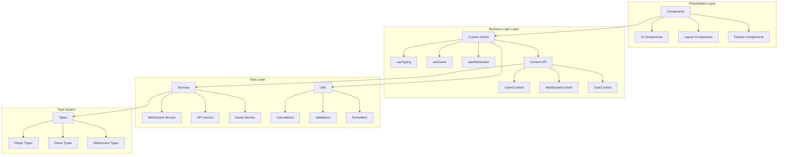
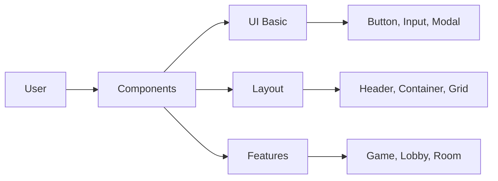
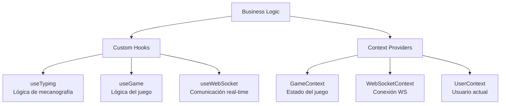
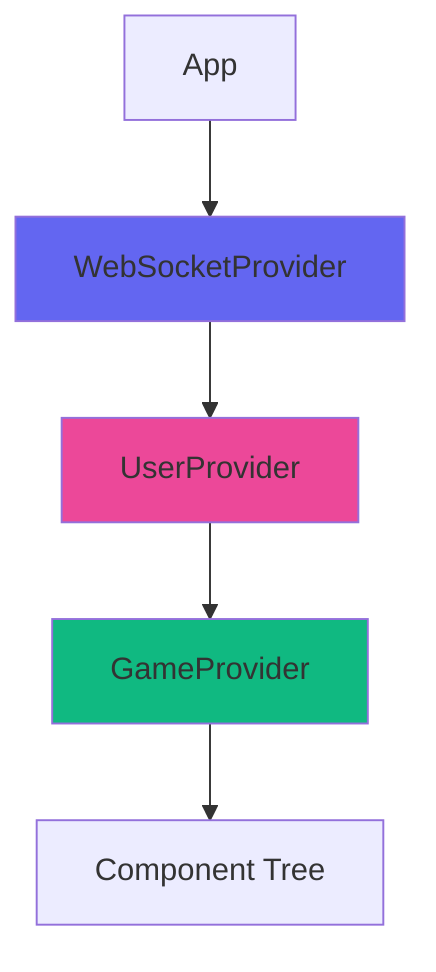
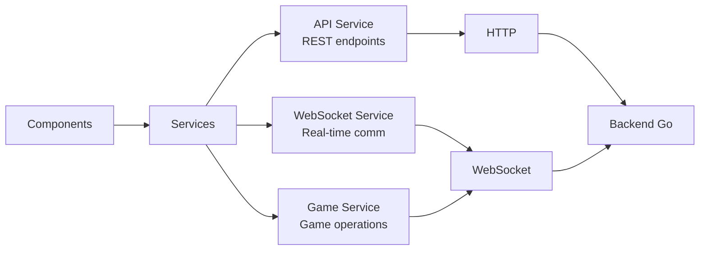
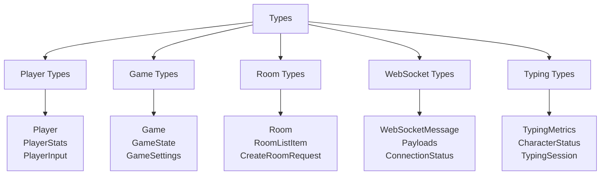
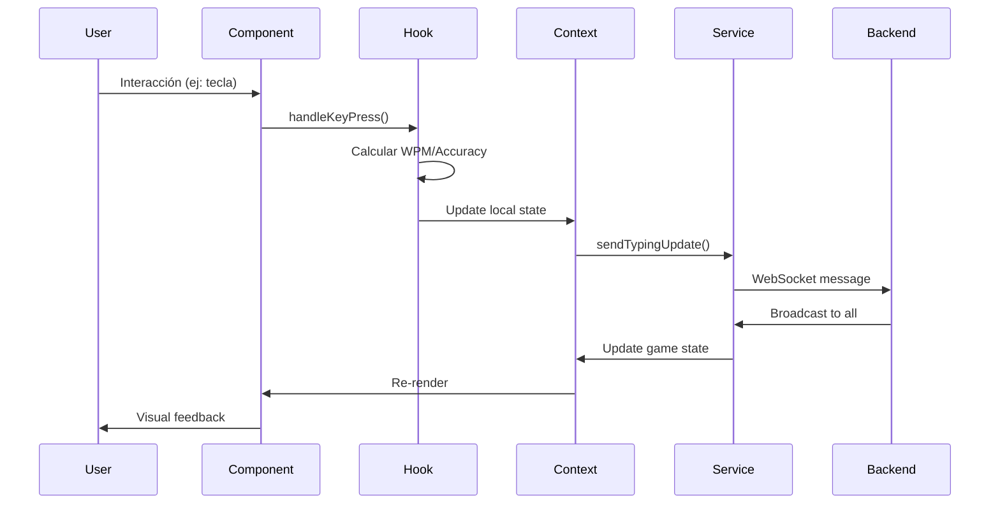
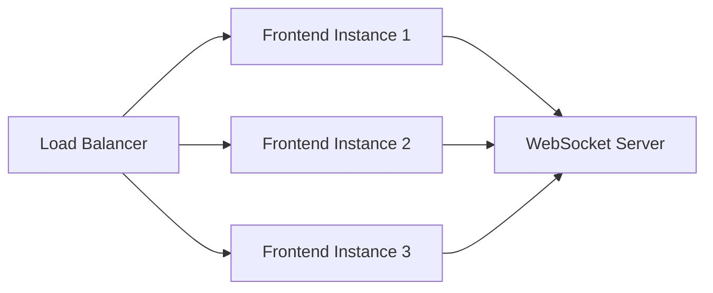

# 🏗️ Arquitectura General del Frontend

## Visión General

El frontend de **Typing Battle Royale** está construido con una arquitectura modular y escalable basada en React con
TypeScript. Sigue los principios de Clean Architecture y Separation of Concerns.

## Diagrama de Arquitectura de Alto Nivel



## Capas de la Arquitectura

### 1️⃣ **Presentation Layer (Capa de Presentación)**

Responsable de la UI y la interacción del usuario.



**Responsabilidades:**

- Renderizar la interfaz de usuario
- Capturar eventos del usuario
- Mostrar feedback visual
- Responsive design

**Componentes principales:**

- `components/UI/` - Componentes básicos reutilizables
- `components/Layout/` - Estructura y layouts
- `components/Game/` - Componentes del juego
- `components/Lobby/` - Componentes del lobby

---

### 2️⃣ **Business Logic Layer (Capa de Lógica de Negocio)**

Contiene toda la lógica de negocio y gestión de estado.



#### Custom Hooks

| Hook              | Propósito                                             |
|-------------------|-------------------------------------------------------|
| `useTyping`       | Maneja la captura de teclas, cálculo de WPM, accuracy |
| `useGame`         | Estado del juego, jugadores, eliminaciones            |
| `useWebSocket`    | Conexión y mensajería WebSocket                       |
| `useCountdown`    | Cuenta regresiva antes de empezar                     |
| `useLocalStorage` | Persistencia de datos locales                         |

#### Context API



**Jerarquía de Providers:**

1. `WebSocketProvider` - Conexión global WebSocket
2. `UserProvider` - Información del usuario
3. `GameProvider` - Estado del juego actual

---

### 3️⃣ **Data Layer (Capa de Datos)**

Maneja la comunicación con el backend y transformación de datos.



#### Services

**API Service** (`services/api.ts`)

```typescript
// REST API calls
getRooms()
getRoom(roomId)
createRoom(data)
```

**WebSocket Service** (`services/websocket.ts`)

```typescript
// WebSocket management
connect()
disconnect()
send(type, payload)
on(type, handler)
```

**Game Service** (`services/gameService.ts`)

```typescript
// Game-specific operations
joinRoom(roomId, username)
startGame(roomId)
sendTypingUpdate(data)
```

---

### 4️⃣ **Type System (Sistema de Tipos)**

TypeScript types para type safety en toda la aplicación.



---

## Flujo de Datos Principal



---

## Patrones de Diseño Utilizados

### 1. **Container/Presentational Pattern**

```typescript
// Container (lógica)
const GameContainer = () => {
    const {game, players} = useGameContext();
    const {handleKeyPress, metrics} = useTyping();

    return <GameView game = {game}
    players = {players}
    onKeyPress = {handleKeyPress}
    />;
};

// Presentational (UI pura)
const GameView = ({game, players, onKeyPress}) => {
    return <div>
...
    </div>;
};
```

### 2. **Custom Hooks Pattern**

Encapsula lógica reutilizable:

```typescript
const useTyping = (options) => {
    const [state, setState] = useState();

    // Lógica compleja aquí

    return {state, actions};
};
```

### 3. **Context + Provider Pattern**

Estado global accesible desde cualquier componente:

```
typescript
const GameContext = createContext();

export const GameProvider = ({children}) => {
    const [state, setState] = useState();
    return <GameContext.Provider value = {state} > {children} < /GameContext.Provider>;
};
```

### 4. **Service Layer Pattern**

Abstracción de la comunicación externa:

```typescript
class WebSocketService {
    connect() {
    }

    send() {
    }

    on() {
    }
}
```

---

## Decisiones Arquitectónicas Clave

### ✅ ¿Por qué Context API en lugar de Redux?

| Aspecto        | Context API     | Redux               |
|----------------|-----------------|---------------------|
| Complejidad    | Baja            | Alta                |
| Boilerplate    | Mínimo          | Mucho               |
| Learning curve | Suave           | Pronunciada         |
| Use case       | Estado moderado | Estado muy complejo |

**Decisión:** Context API es suficiente para este proyecto.

### ✅ ¿Por qué CSS Modules?

- ✅ Scope local automático
- ✅ No requiere dependencias adicionales
- ✅ Mejor performance que CSS-in-JS
- ✅ Fácil de debuggear

### ✅ ¿Por qué WebSocket nativo en lugar de Socket.io?

- ✅ Menor overhead
- ✅ Compatibilidad con backend Go
- ✅ Control total sobre el protocolo
- ✅ Más ligero

---

## Escalabilidad

### Horizontal Scaling



### Vertical Scaling

- Code splitting con React.lazy()
- Memoización con React.memo()
- Virtual scrolling para listas largas
- Debouncing de eventos frecuentes

---

## Performance Considerations

### Optimizaciones Implementadas

```typescript
// 1. Memoización de componentes
export const PlayerList = React.memo(({players}) => {
});

// 2. useCallback para funciones
const handleKeyPress = useCallback((key) => {
}, [deps]);

// 3. useMemo para cálculos costosos
const sortedPlayers = useMemo(() =>
        players.sort((a, b) => b.wpm - a.wpm),
    [players]
);

// 4. Lazy loading de rutas
const Game = lazy(() => import('./components/Game'));
```

---

## Seguridad

### Medidas Implementadas

1. **Validación de Inputs**
    - Username: 3-20 caracteres, alfanuméricos
    - Room name: No empty, max 50 chars

2. **Sanitización de Datos**
    - Escape de HTML en mensajes
    - Validación de tipos en WebSocket

3. **CORS Configuration**
    - Whitelist de orígenes permitidos
    - Credentials handling

---

## Próximos Pasos

Ver los siguientes documentos para profundizar:

- [Estructura del Proyecto](./02-project-structure.md)
- [Flujo de Datos](./03-data-flow.md)
- [Sistema de Types](./04-types-system.md)