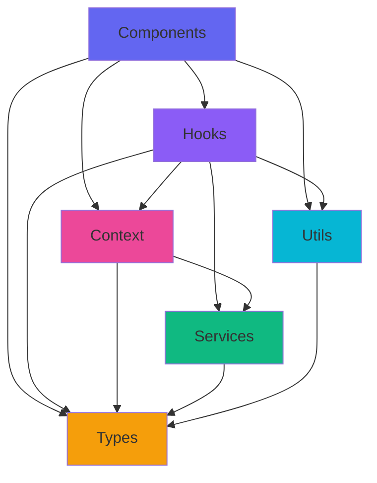

# 📁 Estructura del Proyecto

## Visión General

El proyecto sigue una estructura modular y organizada por características, facilitando el mantenimiento y la escalabilidad.

## Árbol de Directorios Principal
````
frontend/
├── public/
│   ├── index.html
│   ├── favicon.ico
│   └── manifest.json
├── src/
│   ├── components/
│   │   ├── Game/
│   │   ├── Lobby/
│   │   ├── Layout/
│   │   └── UI/
│   ├── context/
│   ├── hooks/
│   ├── services/
│   ├── styles/
│   ├── types/
│   ├── utils/
│   ├── App.tsx
│   ├── App.css
│   ├── index.tsx
│   └── index.css
├── docs/
├── package.json
├── tsconfig.json
├── .gitignore
└── README.md
````

## Estructura Detallada

### Carpeta public - Archivos Estáticos
````
public/
├── index.html          HTML template principal
├── favicon.ico         Icono de la aplicación
├── manifest.json       PWA manifest
└── robots.txt          SEO robots
````

Propósito: Archivos que se sirven directamente sin procesamiento.

### Carpeta src/components - Componentes React

Organización por tipo y funcionalidad.

#### components/UI - Componentes Básicos Reutilizables
````
UI/
├── Button.tsx
├── Button.module.css
├── Input.tsx
├── Input.module.css
├── Modal.tsx
├── Modal.module.css
├── Card.tsx
├── Card.module.css
├── Badge.tsx
├── Badge.module.css
├── ProgressBar.tsx
├── ProgressBar.module.css
├── Spinner.tsx
├── Spinner.module.css
├── ConnectionStatus.tsx
├── ConnectionStatus.module.css
└── index.ts
````

Características:
- Componentes reutilizables sin lógica de negocio
- Altamente personalizables con props
- CSS Modules para estilos aislados
- Completamente tipados con TypeScript

Ejemplo de uso:
````typescript
import { Button, Input, Modal } from '../components/UI';
````

#### components/Layout - Componentes de Estructura
````
Layout/
├── Container.tsx
├── Container.module.css
├── Header.tsx
├── Header.module.css
├── PageLayout.tsx
├── PageLayout.module.css
├── Section.tsx
├── Section.module.css
├── Grid.tsx
├── Grid.module.css
├── Flex.tsx
├── Flex.module.css
└── index.ts
````

Propósito: Proporcionar estructura y layout consistente a través de toda la aplicación.

#### components/Game - Componentes del Juego
````
Game/
├── Game.tsx                    Componente principal del juego
├── Game.module.css
├── TypingArea.tsx              Área donde el usuario escribe
├── TypingArea.module.css
├── GameStats.tsx               Estadísticas en tiempo real
├── GameStats.module.css
├── PlayerList.tsx              Lista de jugadores y progreso
├── PlayerList.module.css
├── Countdown.tsx               Cuenta regresiva 3-2-1-GO
├── Countdown.module.css
├── GameOver.tsx                Pantalla de juego terminado
├── GameOver.module.css
└── index.ts
````

Responsabilidades de cada componente:

- **Game.tsx**: Orquesta el juego completo, gestiona todos los estados
- **TypingArea.tsx**: Captura teclas, valida input, muestra feedback visual
- **GameStats.tsx**: Muestra WPM, accuracy, tiempo transcurrido
- **PlayerList.tsx**: Muestra progreso en tiempo real de todos los jugadores
- **Countdown.tsx**: Cuenta regresiva antes de iniciar
- **GameOver.tsx**: Modal con podio y clasificación final

#### components/Lobby - Componentes del Lobby
````
Lobby/
├── Lobby.tsx                   Vista principal del lobby
├── Lobby.module.css
├── RoomList.tsx                Lista de salas disponibles
├── RoomList.module.css
├── CreateRoom.tsx              Modal para crear nueva sala
├── CreateRoom.module.css
├── JoinRoomModal.tsx           Modal para unirse a sala
├── JoinRoomModal.module.css
├── WaitingRoom.tsx             Sala de espera pre-juego
├── WaitingRoom.module.css
└── index.ts
````

### Carpeta src/context - Estado Global con Context API
````
context/
├── WebSocketContext.tsx        Gestión de conexión WebSocket global
├── GameContext.tsx             Estado del juego actual
├── UserContext.tsx             Información del usuario actual
├── AppProviders.tsx            Wrapper que combina todos los providers
└── index.ts
````

Jerarquía de Providers:
````
AppProviders > WebSocketProvider > UserProvider > GameProvider
````

WebSocketContext contiene:
- **ws**: WebSocketService | null
- **isConnected**: boolean
- **connectionStatus**: ConnectionStatus

UserContext contiene:
- **userId**: string | null
- **username**: string | null
- setUserId, setUsername, clearUser

GameContext contiene:
- room, game, players, currentPlayer
- gameState, isHost, countdown, winner
- joinRoom, leaveRoom, startGame, sendTypingUpdate

### Carpeta src/hooks - Custom Hooks
````
hooks/
├── useWebSocket.ts             Hook para gestionar WebSocket
├── useTyping.ts                Lógica completa de mecanografía
├── useGame.ts                  Lógica del juego y estado
├── useLocalStorage.ts          Persistencia en localStorage
├── useCountdown.ts             Cuenta regresiva configurable
├── useKeyPress.ts              Captura de teclas específicas
├── useSound.ts                 Efectos de sonido
└── index.ts
````

Hooks principales y su propósito:
- **useTyping**: Captura teclas, calcula WPM y accuracy, gestiona estado de escritura
- **useGame**: Sincroniza estado del juego con WebSocket, gestiona jugadores
- **useWebSocket**: Abstracción sobre WebSocket service, facilita envío y recepción
- **useCountdown**: Temporizador regresivo con callbacks
- **useLocalStorage**: Wrapper sobre localStorage con sincronización

### Carpeta src/services - Capa de Servicios
````
services/
├── api.ts                      Llamadas REST API
├── websocket.ts                Servicio WebSocket con reconexión
├── gameService.ts              Operaciones específicas del juego
└── index.ts
````

Responsabilidades:

api.ts:
- getRooms, getRoom, createRoom
- checkRoomExists, getServerStats, healthCheck

websocket.ts:
- Clase WebSocketService con reconexión automática
- Gestión de mensajes por tipo
- Heartbeat (ping/pong)
- Manejo de estados de conexión

gameService.ts:
- joinRoom, leaveRoom, startGame
- sendTypingUpdate, sendChatMessage
- setPlayerReady

### Carpeta src/types - TypeScript Types
````
types/
├── player.types.ts             Player, PlayerStats, PlayerInput
├── game.types.ts               Game, GameState, GameSettings
├── room.types.ts               Room, RoomListItem, CreateRoomRequest
├── websocket.types.ts          WebSocketMessage, Payloads
├── typing.types.ts             TypingMetrics, CharacterStatus
└── index.ts
````

### Principales interfaces:
- **Player**: id, username, progress, wpm, accuracy, alive
- **Game**: id, roomId, state, text, players, startTime
- **Room**: id, name, hostId, players, maxPlayers, state
- **WebSocketMessage**: type, payload, roomId, userId, timestamp
- **TypingMetrics**: wpm, rawWpm, accuracy, correctChars, incorrectChars

### Carpeta src/utils - Funciones Auxiliares
````
utils/
├── calculateWPM.ts             Cálculo de palabras por minuto
├── calculateAccuracy.ts        Cálculo de precisión
├── textUtils.ts                Manipulación y validación de textos
├── timeUtils.ts                Formateo de tiempo
├── colorUtils.ts               Generación de colores para jugadores
├── validationUtils.ts          Validaciones de inputs
├── storageUtils.ts             Helpers para localStorage
└── index.ts
````

Categorías de utilidades:
- **Cálculos**: calculateWPM, calculateAccuracy, calculateProgress
- **Formateo**: formatTime, formatDate, getTextPreview
- **Validación**: validateUsername, validateRoomName, validateGameSettings
- **Colores**: generateRandomColor, assignPlayerColors, getRankColor
- **Storage**: saveToStorage, getFromStorage, saveUsername, getSavedUsername

### Carpeta src/styles - Estilos Globales
````
styles/
├── variables.css               Variables CSS (colores, espaciado, etc)
└── global.css                  Estilos globales de la aplicación
````

variables.css contiene:

- **Colores**: primary, secondary, success, warning, danger
- **Espaciado**: spacing-xs a spacing-2xl
- **Tipografía**: font-primary, font-mono
- Bordes, sombras, transiciones, z-index

## Convenciones de Nombres

Archivos y Carpetas:
- **Componentes**: PascalCase (Button.tsx)
- **CSS Modules**: Component.module.css
- **Hooks**: camelCase con prefijo use (useTyping.ts)
- **Services**: camelCase (api.ts, websocket.ts)
- **Types**: camelCase con sufijo .types (player.types.ts)
- **Utils**: camelCase (calculateWPM.ts)

Componentes React:
- Export nombrado para componentes reutilizables
- Export default para páginas/rutas

Hooks:
- Siempre empiezan con 'use'
- Nombre descriptivo de su función

## Barrel Exports

Cada carpeta principal tiene un index.ts que re-exporta todo:
````typescript
// components/UI/index.ts
export { Button } from './Button';
export { Input } from './Input';
export { Modal } from './Modal';
````

Ventajas:
- Imports más limpios
- Facilita refactoring
- Oculta estructura interna
- Mejor tree-shaking

Uso:
````typescript
import { Button, Input, Modal } from '../components/UI';
````

## Flujo de Dependencias


Reglas:
1. Components solo importan de hooks, context, types, utils
2. Hooks pueden importar de services, context, utils, types
3. Context puede importar de services, types
4. Services solo importan types
5. Utils solo importan types
6. Types no importan nada (solo otros types)
7. Nunca crear dependencias circulares

## Tamaños Recomendados de Archivos

Componentes: 100-300 líneas (si es más, dividir)
- **Hooks**: 50-150 líneas
- **Services**: 100-300 líneas
- **Utils**: Individual por función, 10-50 líneas cada una
- **Types**: Agrupar por dominio, 50-150 líneas

## Patrón de Organización por Característica

Si el proyecto crece, considerar organizar por feature:
````
src/
├── features/
│   ├── game/
│   │   ├── components/
│   │   ├── hooks/
│   │   ├── types/
│   │   └── utils/
│   └── lobby/
│       ├── components/
│       ├── hooks/
│       ├── types/
│       └── utils/
├── shared/
│   ├── components/
│   ├── hooks/
│   └── utils/
└── core/
├── services/
└── context/
````

## Próximos Pasos

Continúa con:
- [Flujo de Datos](./03-data-flow.md)
- [Sistema de Types](./04-types-system.md)
- [Utilities](./05-utilities.md)