# 🔄 Flujo de Datos

## Visión General

Este documento describe cómo fluye la información a través de la aplicación, desde la interacción del usuario hasta la actualización del estado y la sincronización con otros jugadores.

## Arquitectura de Flujo de Datos

La aplicación sigue un flujo unidireccional de datos con comunicación bidireccional en tiempo real a través de WebSocket.

### Flujo Unidireccional

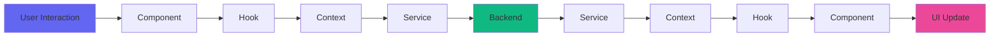
```mermaid
graph LR
    A[User Interaction] --> B[Component]
    B --> C[Hook]
    C --> D[Context]
    D --> E[Service]
    E --> F[Backend]
    
    F --> G[Service]
    G --> H[Context]
    H --> I[Hook]
    I --> J[Component]
    J --> K[UI Update]
    
    style A fill:#6366f1
    style F fill:#10b981
    style K fill:#ec4899
```

## Flujos Principales

### 1. Flujo de Autenticación y Entrada al Juego

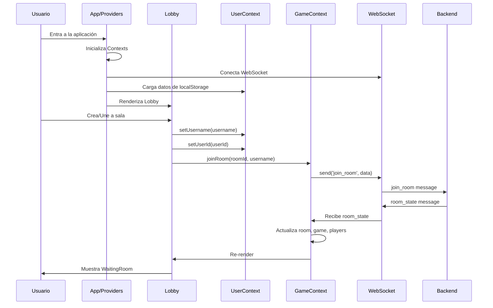
```mermaid
sequenceDiagram
    participant U as Usuario
    participant A as App/Providers
    participant L as Lobby
    participant UC as UserContext
    participant GC as GameContext
    participant WS as WebSocket
    participant B as Backend
    
    U->>A: Entra a la aplicación
    A->>A: Inicializa Contexts
    A->>WS: Conecta WebSocket
    A->>UC: Carga datos de localStorage
    A->>L: Renderiza Lobby
    
    U->>L: Crea/Une a sala
    L->>UC: setUsername(username)
    L->>UC: setUserId(userId)
    L->>GC: joinRoom(roomId, username)
    GC->>WS: send('join_room', data)
    WS->>B: join_room message
    
    B->>WS: room_state message
    WS->>GC: Recibe room_state
    GC->>GC: Actualiza room, game, players
    GC->>L: Re-render
    L->>U: Muestra WaitingRoom
```

### 2. Flujo de Captura de Teclas y Cálculo de Métricas

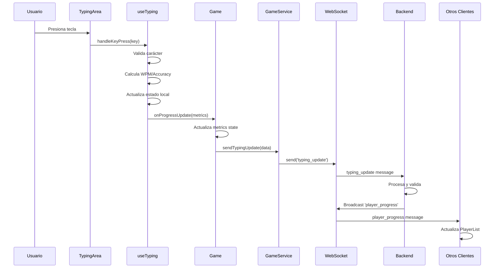
```mermaid
sequenceDiagram
    participant U as Usuario
    participant TA as TypingArea
    participant UT as useTyping
    participant G as Game
    participant GS as GameService
    participant WS as WebSocket
    participant B as Backend
    participant OC as Otros Clientes
    
    U->>TA: Presiona tecla
    TA->>UT: handleKeyPress(key)
    UT->>UT: Valida carácter
    UT->>UT: Calcula WPM/Accuracy
    UT->>UT: Actualiza estado local
    UT->>G: onProgressUpdate(metrics)
    G->>G: Actualiza metrics state
    G->>GS: sendTypingUpdate(data)
    GS->>WS: send('typing_update')
    WS->>B: typing_update message
    
    B->>B: Procesa y valida
    B->>WS: Broadcast 'player_progress'
    WS->>OC: player_progress message
    OC->>OC: Actualiza PlayerList
```

**Flujo detallado de validación de tecla:**

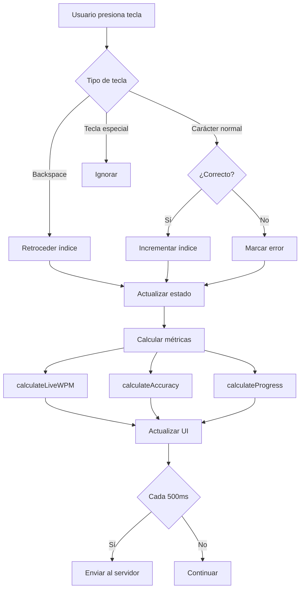
```mermaid
graph TD
    A[Usuario presiona tecla] --> B{Tipo de tecla}
    B -->|Backspace| C[Retroceder índice]
    B -->|Carácter normal| D{¿Correcto?}
    B -->|Tecla especial| E[Ignorar]
    
    D -->|Sí| F[Incrementar índice]
    D -->|No| G[Marcar error]
    
    C --> H[Actualizar estado]
    F --> H
    G --> H
    
    H --> I[Calcular métricas]
    I --> J[calculateLiveWPM]
    I --> K[calculateAccuracy]
    I --> L[calculateProgress]
    
    J --> M[Actualizar UI]
    K --> M
    L --> M
    
    M --> N{Cada 500ms}
    N -->|Sí| O[Enviar al servidor]
    N -->|No| P[Continuar]
```

### 3. Flujo de Creación de Sala

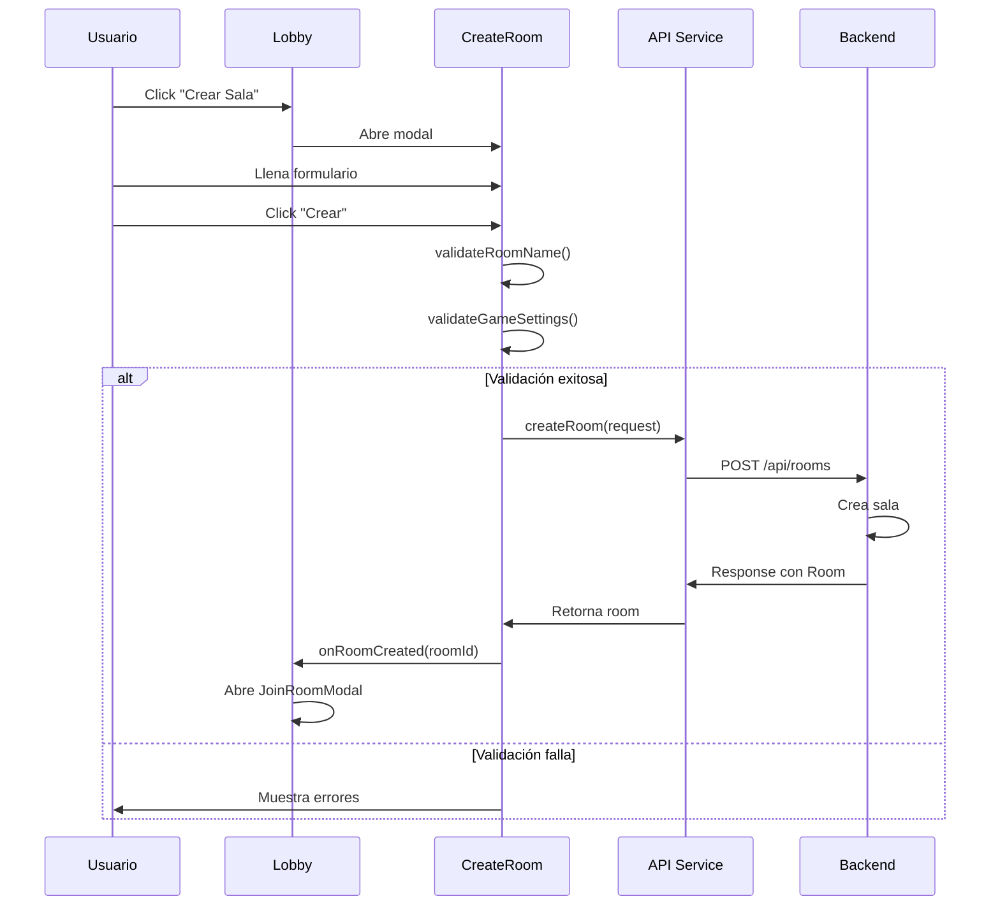
```mermaid
sequenceDiagram
    participant U as Usuario
    participant L as Lobby
    participant CR as CreateRoom
    participant API as API Service
    participant B as Backend
    
    U->>L: Click "Crear Sala"
    L->>CR: Abre modal
    U->>CR: Llena formulario
    U->>CR: Click "Crear"
    
    CR->>CR: validateRoomName()
    CR->>CR: validateGameSettings()
    
    alt Validación exitosa
        CR->>API: createRoom(request)
        API->>B: POST /api/rooms
        B->>B: Crea sala
        B->>API: Response con Room
        API->>CR: Retorna room
        CR->>L: onRoomCreated(roomId)
        L->>L: Abre JoinRoomModal
    else Validación falla
        CR->>U: Muestra errores
    end
```

### 4. Flujo de Unirse a Sala

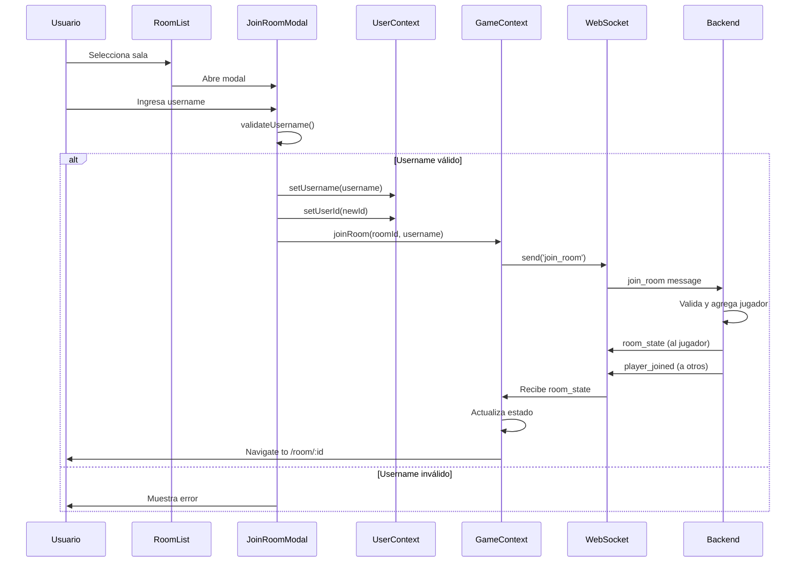
```mermaid
sequenceDiagram
    participant U as Usuario
    participant RL as RoomList
    participant JRM as JoinRoomModal
    participant UC as UserContext
    participant GC as GameContext
    participant WS as WebSocket
    participant B as Backend
    
    U->>RL: Selecciona sala
    RL->>JRM: Abre modal
    U->>JRM: Ingresa username
    JRM->>JRM: validateUsername()
    
    alt Username válido
        JRM->>UC: setUsername(username)
        JRM->>UC: setUserId(newId)
        JRM->>GC: joinRoom(roomId, username)
        GC->>WS: send('join_room')
        WS->>B: join_room message
        
        B->>B: Valida y agrega jugador
        B->>WS: room_state (al jugador)
        B->>WS: player_joined (a otros)
        
        WS->>GC: Recibe room_state
        GC->>GC: Actualiza estado
        GC->>U: Navigate to /room/:id
    else Username inválido
        JRM->>U: Muestra error
    end
```

### 5. Flujo de Inicio de Juego

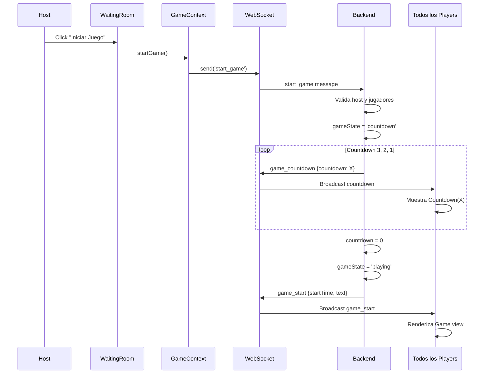
```mermaid
sequenceDiagram
    participant H as Host
    participant WR as WaitingRoom
    participant GC as GameContext
    participant WS as WebSocket
    participant B as Backend
    participant P as Todos los Players
    
    H->>WR: Click "Iniciar Juego"
    WR->>GC: startGame()
    GC->>WS: send('start_game')
    WS->>B: start_game message
    
    B->>B: Valida host y jugadores
    B->>B: gameState = 'countdown'
    
    loop Countdown 3, 2, 1
        B->>WS: game_countdown {countdown: X}
        WS->>P: Broadcast countdown
        P->>P: Muestra Countdown(X)
    end
    
    B->>B: countdown = 0
    B->>B: gameState = 'playing'
    B->>WS: game_start {startTime, text}
    WS->>P: Broadcast game_start
    P->>P: Renderiza Game view
```

### 6. Flujo de Eliminación de Jugadores

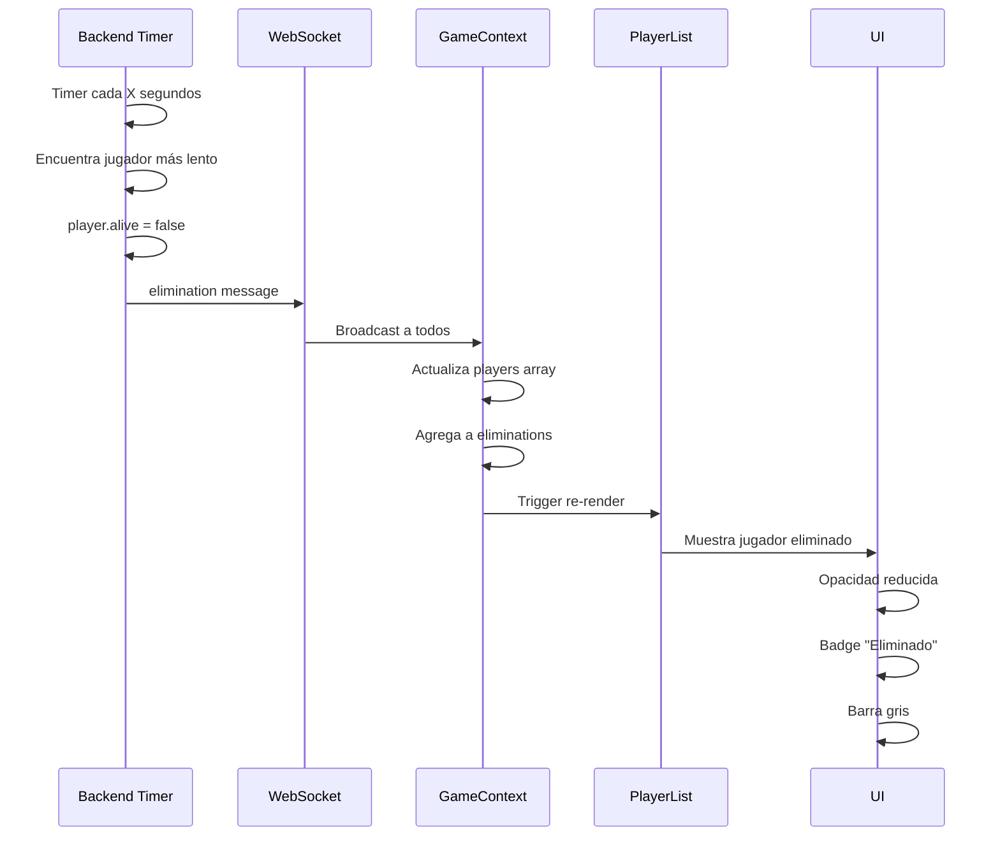
```mermaid
sequenceDiagram
    participant B as Backend Timer
    participant WS as WebSocket
    participant GC as GameContext
    participant PL as PlayerList
    participant U as UI
    
    B->>B: Timer cada X segundos
    B->>B: Encuentra jugador más lento
    B->>B: player.alive = false
    
    B->>WS: elimination message
    WS->>GC: Broadcast a todos
    
    GC->>GC: Actualiza players array
    GC->>GC: Agrega a eliminations
    
    GC->>PL: Trigger re-render
    PL->>U: Muestra jugador eliminado
    U->>U: Opacidad reducida
    U->>U: Badge "Eliminado"
    U->>U: Barra gris
```

**Lógica de eliminación en el backend:**

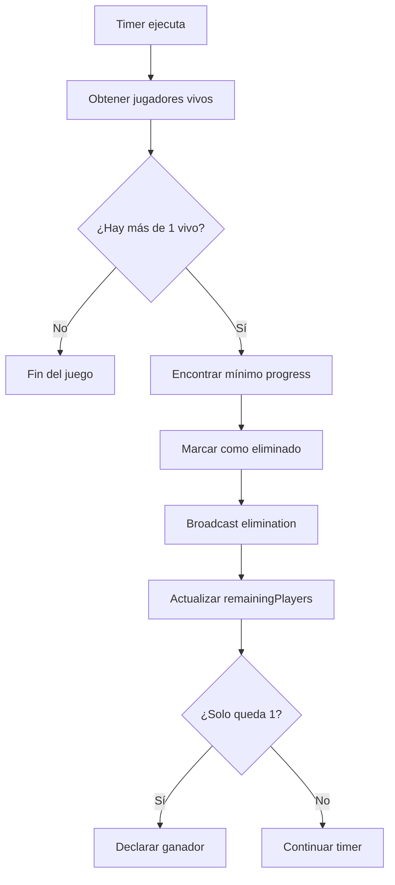
```mermaid
graph TD
    A[Timer ejecuta] --> B[Obtener jugadores vivos]
    B --> C{¿Hay más de 1 vivo?}
    C -->|No| D[Fin del juego]
    C -->|Sí| E[Encontrar mínimo progress]
    E --> F[Marcar como eliminado]
    F --> G[Broadcast elimination]
    G --> H[Actualizar remainingPlayers]
    H --> I{¿Solo queda 1?}
    I -->|Sí| J[Declarar ganador]
    I -->|No| K[Continuar timer]
```

### 7. Flujo de Finalización del Juego

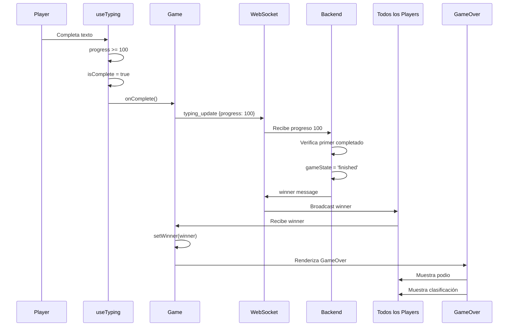
```mermaid
sequenceDiagram
    participant P as Player
    participant UT as useTyping
    participant G as Game
    participant WS as WebSocket
    participant B as Backend
    participant ALL as Todos los Players
    participant GO as GameOver
    
    P->>UT: Completa texto
    UT->>UT: progress >= 100
    UT->>UT: isComplete = true
    UT->>G: onComplete()
    G->>WS: typing_update {progress: 100}
    
    WS->>B: Recibe progreso 100
    B->>B: Verifica primer completado
    B->>B: gameState = 'finished'
    
    B->>WS: winner message
    WS->>ALL: Broadcast winner
    
    ALL->>G: Recibe winner
    G->>G: setWinner(winner)
    G->>GO: Renderiza GameOver
    
    GO->>ALL: Muestra podio
    GO->>ALL: Muestra clasificación
```

### 8. Flujo de WebSocket y Reconexión

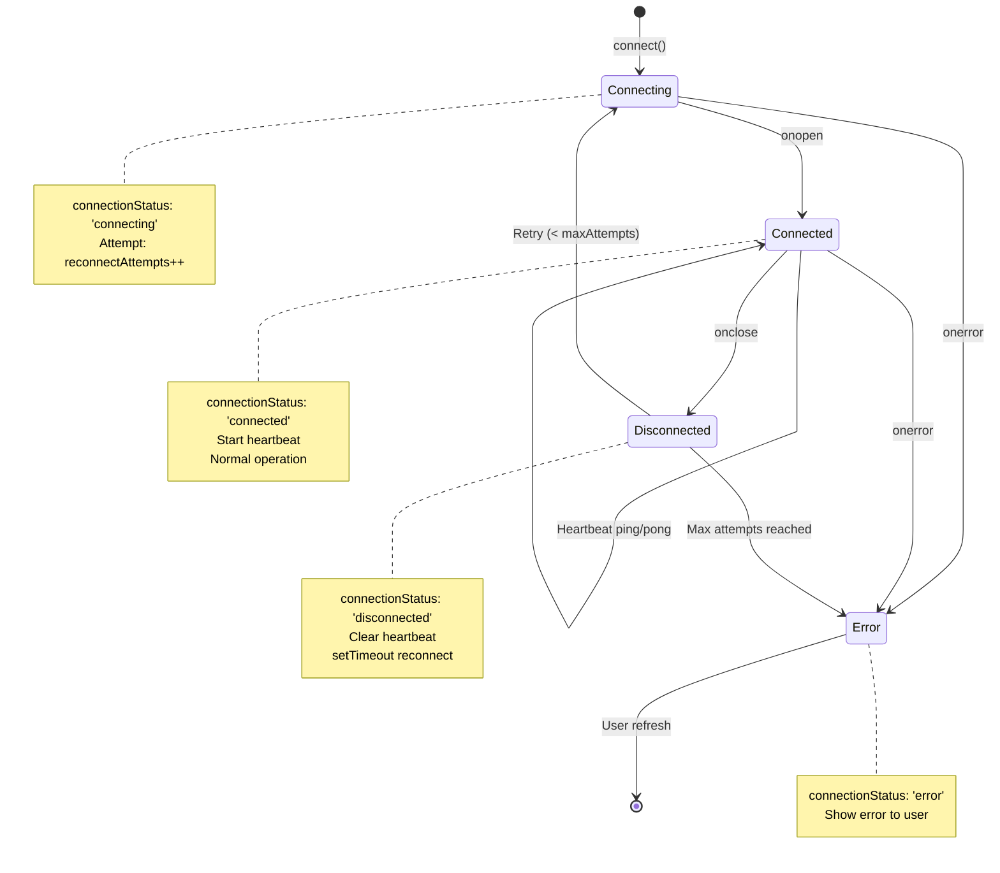
```mermaid
stateDiagram-v2
    [*] --> Connecting: connect()
    Connecting --> Connected: onopen
    Connecting --> Error: onerror
    
    Connected --> Disconnected: onclose
    Connected --> Error: onerror
    
    Disconnected --> Connecting: Retry (< maxAttempts)
    Disconnected --> Error: Max attempts reached
    
    Error --> [*]: User refresh
    
    Connected --> Connected: Heartbeat ping/pong
    
    note right of Connected
        connectionStatus: 'connected'
        Start heartbeat
        Normal operation
    end note
    
    note right of Connecting
        connectionStatus: 'connecting'
        Attempt: reconnectAttempts++
    end note
    
    note right of Disconnected
        connectionStatus: 'disconnected'
        Clear heartbeat
        setTimeout reconnect
    end note
    
    note right of Error
        connectionStatus: 'error'
        Show error to user
    end note
```

**Flujo detallado de reconexión:**

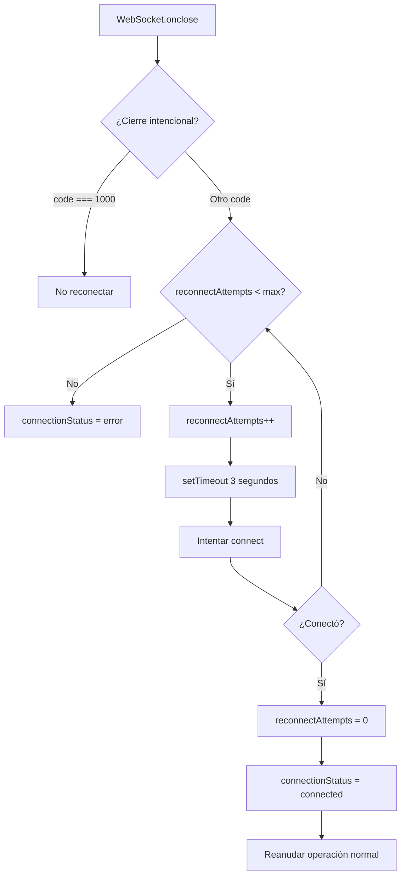
```mermaid
graph TD
    A[WebSocket.onclose] --> B{¿Cierre intencional?}
    B -->|code === 1000| C[No reconectar]
    B -->|Otro code| D{reconnectAttempts < max?}
    
    D -->|No| E[connectionStatus = error]
    D -->|Sí| F[reconnectAttempts++]
    
    F --> G[setTimeout 3 segundos]
    G --> H[Intentar connect]
    
    H --> I{¿Conectó?}
    I -->|Sí| J[reconnectAttempts = 0]
    I -->|No| D
    
    J --> K[connectionStatus = connected]
    K --> L[Reanudar operación normal]
```

## Patrones de Actualización de Estado

### Pattern 1: Optimistic Update

**Usado en:** Captura de teclas, interacciones frecuentes

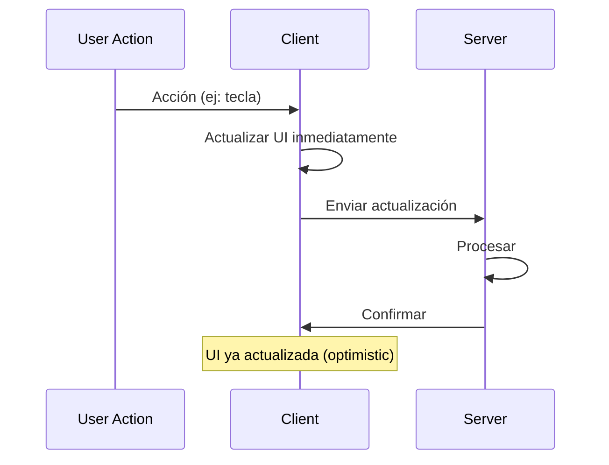
```mermaid
sequenceDiagram
    participant U as User Action
    participant C as Client
    participant S as Server
    
    U->>C: Acción (ej: tecla)
    C->>C: Actualizar UI inmediatamente
    C->>S: Enviar actualización
    S->>S: Procesar
    S->>C: Confirmar
    
    Note over C: UI ya actualizada (optimistic)
```

**Ventajas:**
- UI súper responsiva
- No hay lag perceptible
- Mejor experiencia de usuario

**Desventajas:**
- Posible inconsistencia temporal
- Requiere manejo de conflictos

### Pattern 2: Server Confirmation

**Usado en:** Crear sala, operaciones críticas

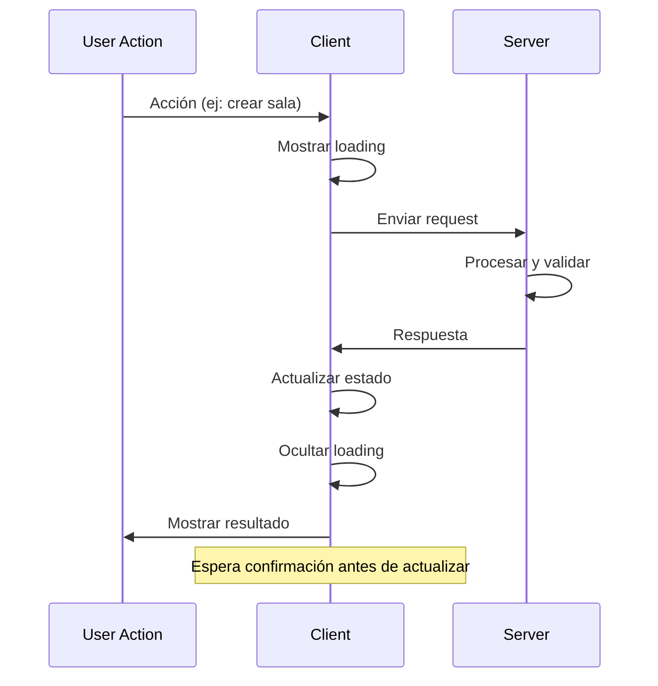
```mermaid
sequenceDiagram
    participant U as User Action
    participant C as Client
    participant S as Server
    
    U->>C: Acción (ej: crear sala)
    C->>C: Mostrar loading
    C->>S: Enviar request
    S->>S: Procesar y validar
    S->>C: Respuesta
    C->>C: Actualizar estado
    C->>C: Ocultar loading
    C->>U: Mostrar resultado
    
    Note over C: Espera confirmación antes de actualizar
```

**Ventajas:**
- Consistencia garantizada
- Manejo claro de errores
- Fuente única de verdad

**Desventajas:**
- Latencia perceptible
- Requiere estados de loading

### Pattern 3: Server-Driven State

**Usado en:** Lista de jugadores, estado del juego

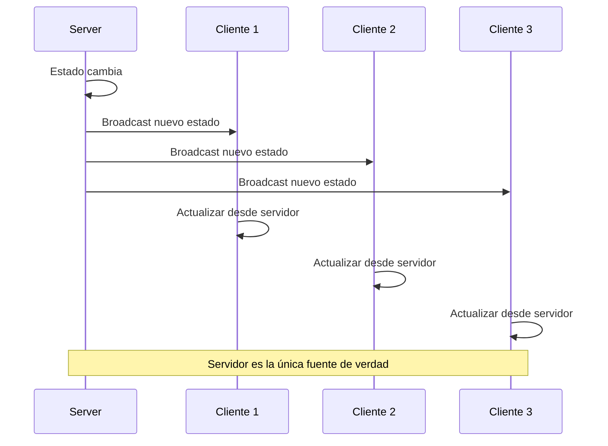
```mermaid
sequenceDiagram
    participant S as Server
    participant C1 as Cliente 1
    participant C2 as Cliente 2
    participant C3 as Cliente 3
    
    S->>S: Estado cambia
    S->>C1: Broadcast nuevo estado
    S->>C2: Broadcast nuevo estado
    S->>C3: Broadcast nuevo estado
    
    C1->>C1: Actualizar desde servidor
    C2->>C2: Actualizar desde servidor
    C3->>C3: Actualizar desde servidor
    
    Note over S,C3: Servidor es la única fuente de verdad
```

**Ventajas:**
- Sincronización perfecta
- Menos lógica en cliente
- Consistencia garantizada

**Desventajas:**
- Depende de conexión estable
- Latencia de red visible

```markdown

## Sincronización Multi-Cliente

### Ejemplo: Jugador A escribe, Jugadores B y C ven su progreso

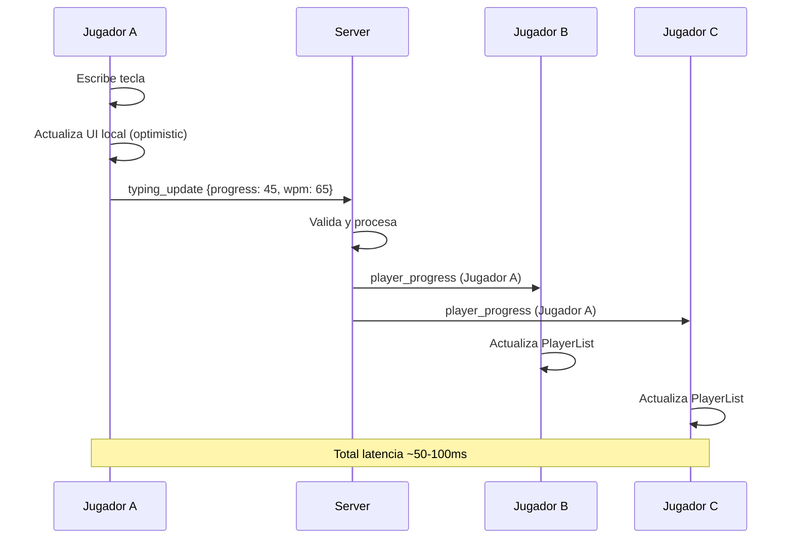
```mermaid
sequenceDiagram
    participant A as Jugador A
    participant SA as Server
    participant B as Jugador B
    participant C as Jugador C
    
    A->>A: Escribe tecla
    A->>A: Actualiza UI local (optimistic)
    A->>SA: typing_update {progress: 45, wpm: 65}
    
    SA->>SA: Valida y procesa
    SA->>B: player_progress (Jugador A)
    SA->>C: player_progress (Jugador A)
    
    B->>B: Actualiza PlayerList
    C->>C: Actualiza PlayerList
    
    Note over A,C: Total latencia ~50-100ms
```

### Flujo completo de sincronización con múltiples jugadores

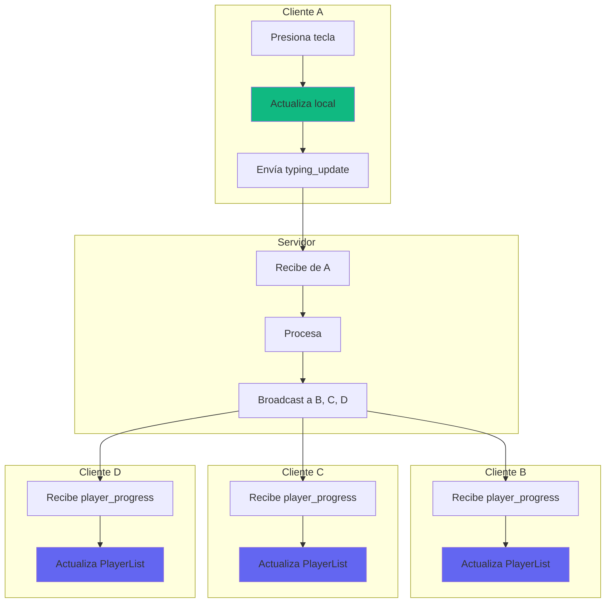
```mermaid
graph TB
    subgraph "Cliente A"
        A1[Presiona tecla] --> A2[Actualiza local]
        A2 --> A3[Envía typing_update]
    end
    
    subgraph "Servidor"
        S1[Recibe de A] --> S2[Procesa]
        S2 --> S3[Broadcast a B, C, D]
    end
    
    subgraph "Cliente B"
        B1[Recibe player_progress] --> B2[Actualiza PlayerList]
    end
    
    subgraph "Cliente C"
        C1[Recibe player_progress] --> C2[Actualiza PlayerList]
    end
    
    subgraph "Cliente D"
        D1[Recibe player_progress] --> D2[Actualiza PlayerList]
    end
    
    A3 --> S1
    S3 --> B1
    S3 --> C1
    S3 --> D1
    
    style A2 fill:#10b981
    style B2 fill:#6366f1
    style C2 fill:#6366f1
    style D2 fill:#6366f1
```

### Timeline de eventos sincronizados


```mermaid
gantt
    title Sincronización en Tiempo Real
    dateFormat x
    axisFormat %L ms
    
    section Jugador A
    Escribe tecla           :0, 10
    Calcula métricas        :10, 20
    Actualiza UI local      :20, 30
    Envía al servidor       :30, 80
    
    section Servidor
    Recibe mensaje          :80, 90
    Procesa datos           :90, 100
    Broadcast a otros       :100, 150
    
    section Jugador B
    Recibe actualización    :150, 160
    Actualiza PlayerList    :160, 180
    
    section Jugador C
    Recibe actualización    :150, 160
    Actualiza PlayerList    :160, 180
```

## Gestión de Conflictos

### Escenario: Dos jugadores completan al mismo tiempo

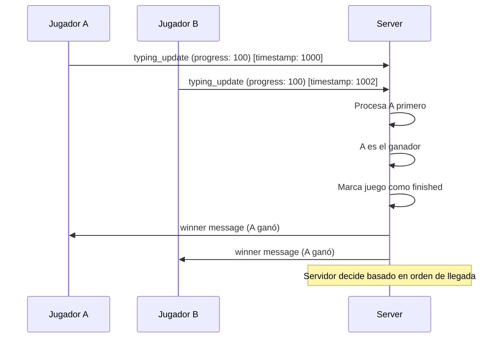
```mermaid
sequenceDiagram
    participant A as Jugador A
    participant B as Jugador B
    participant S as Server
    
    A->>S: typing_update (progress: 100) [timestamp: 1000]
    B->>S: typing_update (progress: 100) [timestamp: 1002]
    
    S->>S: Procesa A primero
    S->>S: A es el ganador
    S->>S: Marca juego como finished
    
    S->>A: winner message (A ganó)
    S->>B: winner message (A ganó)
    
    Note over S: Servidor decide basado en orden de llegada
```

### Estrategias de resolución de conflictos

**1. Server Timestamp (Implementado)**
```typescript
// El servidor procesa mensajes en orden de llegada
// Primer jugador en alcanzar 100% gana
if (player.progress >= 100 && gameState === 'playing') {
  gameState = 'finished';
  winner = player;
  broadcast('winner', { winner, finalPlayers });
}
```

**2. Optimistic Locking**
```typescript
interface GameState {
  version: number;
  data: Game;
}

// Cliente envía con versión esperada
send('update', { data, expectedVersion: 5 });

// Servidor valida versión
if (currentVersion !== expectedVersion) {
  reject('conflict');
}
```

**3. Last Write Wins**
- Más simple pero puede perder datos
- Útil para datos no críticos
- No recomendado para este proyecto

## Throttling y Debouncing

### Throttling en typing updates


```mermaid
gantt
    title Throttling de Actualizaciones (500ms)
    dateFormat x
    axisFormat %L ms
    
    section Teclas Presionadas
    Tecla 1     :0, 10
    Tecla 2     :100, 110
    Tecla 3     :200, 210
    Tecla 4     :300, 310
    Tecla 5     :400, 410
    Tecla 6     :500, 510
    Tecla 7     :600, 610
    
    section Actualizaciones Enviadas
    Update 1    :0, 50
    Update 2    :500, 550
```

### Implementación en useTyping

```typescript
// Throttling con intervalo de 500ms
useEffect(() => {
  if (startTime && !isComplete) {
    updateIntervalRef.current = setInterval(() => {
      const newMetrics = calculateMetrics();
      setMetrics(newMetrics);
      onProgressUpdate?.(newMetrics); // Solo cada 500ms
    }, 500);

    return () => {
      if (updateIntervalRef.current) {
        clearInterval(updateIntervalRef.current);
      }
    };
  }
}, [startTime, isComplete, calculateMetrics, onProgressUpdate]);
```

### Comparación: Sin throttling vs Con throttling

| Métrica | Sin Throttling | Con Throttling (500ms) |
|---------|----------------|------------------------|
| Mensajes/minuto | ~3000 (50 WPM * 60s) | ~120 |
| Carga del servidor | Alta | Baja |
| Latencia percibida | Ninguna | Ninguna |
| Ancho de banda | ~150 KB | ~6 KB |
| Precisión visual | 100% | 99.5% |

**Beneficios del throttling:**
- ✅ Reduce carga del servidor en 96%
- ✅ Menos mensajes WebSocket
- ✅ Mejor rendimiento general
- ✅ Experiencia de usuario no afectada
- ✅ Escalable a más jugadores

## Estado Local vs Estado del Servidor

### Matriz de decisión

| Dato | Solo Local | Solo Servidor | Sincronizado | Frecuencia |
|------|-----------|---------------|--------------|------------|
| Tecla actual | ✅ | ❌ | ❌ | Tiempo real |
| Progress del jugador | ✅ | ✅ | ✅ | Cada 500ms |
| Caracteres escritos | ✅ | ❌ | ❌ | - |
| Array de errores | ✅ | ❌ | ❌ | - |
| WPM actual | ✅ | ✅ | ✅ | Cada 500ms |
| Accuracy | ✅ | ✅ | ✅ | Cada 500ms |
| Lista de jugadores | ❌ | ✅ | ✅ | Tiempo real |
| Estado del juego | ❌ | ✅ | ✅ | Tiempo real |
| Countdown | ❌ | ✅ | ✅ | Cada 1s |
| Ganador | ❌ | ✅ | ✅ | Una vez |

### Diagrama de propiedad de datos

```mermaid
graph TB
    subgraph "Estado Local Únicamente"
        L1[Teclas presionadas]
        L2[currentIndex]
        L3[typedText]
        L4[Array de errores]
        L5[characterStatuses]
    end
    
    subgraph "Estado Sincronizado"
        S1[Progress]
        S2[WPM]
        S3[Accuracy]
        S4[Player stats]
    end
    
    subgraph "Estado del Servidor Únicamente"
        R1[Lista completa de jugadores]
        R2[GameState]
        R3[Countdown]
        R4[Eliminaciones]
        R5[Ganador]
    end
    
    L1 --> S1
    L2 --> S1
    L3 --> S2
    L4 --> S3
    
    S1 --> R4
    S2 --> R4
    S3 --> R4
    
    style L1 fill:#6366f1
    style S1 fill:#10b981
    style R1 fill:#ec4899
```

## Propagación de Cambios

### Árbol de dependencias de estado

```mermaid
graph TD
    A[Usuario presiona tecla] --> B[useTyping actualiza]
    
    B --> C[characterStatuses]
    B --> D[currentIndex]
    B --> E[metrics]
    
    C --> F[TypingArea re-render]
    E --> G[GameStats re-render]
    
    E --> H[onProgressUpdate callback]
    H --> I[Game.sendTypingUpdate]
    I --> J[WebSocket.send]
    
    J --> K[Backend procesa]
    K --> L[Broadcast player_progress]
    
    L --> M[GameContext.players update]
    M --> N[PlayerList re-render]
    
    style A fill:#6366f1
    style K fill:#10b981
    style F fill:#ec4899
    style G fill:#ec4899
    style N fill:#ec4899
```

### Optimización de re-renders

```typescript
// ❌ Sin optimización - Re-render en cada tecla
const PlayerItem = ({ player }) => {
  return <div>{player.username}: {player.progress}%</div>;
};

// ✅ Con React.memo - Solo re-render si player cambia
const PlayerItem = React.memo(({ player }) => {
  return <div>{player.username}: {player.progress}%</div>;
}, (prevProps, nextProps) => {
  // Solo re-render si estos valores cambian
  return prevProps.player.progress === nextProps.player.progress &&
         prevProps.player.wpm === nextProps.player.wpm &&
         prevProps.player.alive === nextProps.player.alive;
});
```

## Manejo de Latencia

### Estrategias para ocultar latencia

```mermaid
graph LR
    A[Acción del Usuario] --> B{Tipo de operación}
    
    B -->|Escritura| C[Optimistic Update]
    B -->|Crítica| D[Loading State]
    B -->|Read| E[Cache Local]
    
    C --> F[UI Responsive]
    D --> G[Feedback Visual]
    E --> H[Instantáneo]
    
    F --> I[Sincronizar en background]
    G --> I
    H --> I
```

### Ejemplo: Latencia de red variable

```mermaid
gantt
    title Experiencia con Diferentes Latencias
    dateFormat x
    axisFormat %L ms
    
    section Usuario escribe
    Tecla presionada   :0, 10
    
    section UI Local (0ms latencia)
    Actualización visible :10, 20
    
    section Red Rápida (50ms)
    Envío + Respuesta    :20, 70
    Otros ven cambio     :70, 80
    
    section Red Lenta (200ms)
    Envío + Respuesta    :20, 220
    Otros ven cambio     :220, 230
    
    section Red Muy Lenta (500ms)
    Envío + Respuesta    :20, 520
    Otros ven cambio     :520, 530
```

### Indicadores visuales de sincronización

```typescript
// Estado de sincronización en GameStats
interface SyncStatus {
  lastUpdate: number;
  pending: boolean;
  synced: boolean;
}

// Visual feedback
{syncStatus.pending && (
  <Badge variant="warning" size="sm">
    Sincronizando...
  </Badge>
)}

{syncStatus.synced && (
  <Badge variant="success" size="sm">
    ✓ Sincronizado
  </Badge>
)}
```

## Casos Extremos

### 1. Desconexión temporal

```mermaid
sequenceDiagram
    participant U as Usuario
    participant C as Cliente
    participant S as Servidor
    
    U->>C: Escribiendo...
    C->>C: Actualiza local
    C->>S: typing_update
    
    Note over C,S: Conexión se pierde
    
    U->>C: Sigue escribiendo
    C->>C: Actualiza local
    C->>S: ❌ Falla envío
    
    Note over C: Cola de mensajes pendientes
    
    Note over C,S: Reconecta
    
    C->>S: Envía últimas métricas
    S->>C: Confirma
    
    Note over C: Sincronizado
```

### 2. Jugador se queda rezagado

```mermaid
graph TD
    A[Detectar jugador inactivo] --> B{Tiempo sin actualizaciones}
    B -->|> 5 segundos| C[Marcar como posiblemente desconectado]
    B -->|> 10 segundos| D[Marcar como desconectado]
    
    C --> E[Mostrar indicador visual]
    D --> F[Eliminar del juego]
    F --> G[Broadcast player_left]
```

### 3. Spam de actualizaciones

```typescript
// Protección contra spam en el servidor
class RateLimiter {
  private updates: Map<string, number[]> = new Map();
  private readonly maxUpdatesPerSecond = 5;
  
  canUpdate(playerId: string): boolean {
    const now = Date.now();
    const playerUpdates = this.updates.get(playerId) || [];
    
    // Limpiar updates antiguos (> 1 segundo)
    const recentUpdates = playerUpdates.filter(t => now - t < 1000);
    
    if (recentUpdates.length >= this.maxUpdatesPerSecond) {
      return false; // Rate limit exceeded
    }
    
    recentUpdates.push(now);
    this.updates.set(playerId, recentUpdates);
    return true;
  }
}
```

## Métricas de Rendimiento

### KPIs del flujo de datos

| Métrica                               | Objetivo | Crítico si |
|---------------------------------------|----------|------------|
| Latencia local (tecla → UI)           | < 16ms   | > 50ms     |
| Latencia servidor (envío → broadcast) | < 100ms  | > 500ms    |
| Mensajes WebSocket/min/jugador        | < 150    | > 300      |
| Re-renders/segundo                    | < 60     | > 100      |
| Tamaño mensaje promedio               | < 1 KB   | > 5 KB     |
| Tasa de reconexión exitosa            | > 95%    | < 80%      |

### Monitoreo en tiempo real

```typescript
// Hook para métricas de rendimiento
const usePerformanceMetrics = () => {
  const [metrics, setMetrics] = useState({
    messagesSent: 0,
    messagesReceived: 0,
    averageLatency: 0,
    reconnections: 0,
    lastUpdate: Date.now(),
  });

  const trackMessage = useCallback((type: 'sent' | 'received', latency?: number) => {
    setMetrics(prev => ({
      ...prev,
      messagesSent: type === 'sent' ? prev.messagesSent + 1 : prev.messagesSent,
      messagesReceived: type === 'received' ? prev.messagesReceived + 1 : prev.messagesReceived,
      averageLatency: latency 
        ? (prev.averageLatency + latency) / 2 
        : prev.averageLatency,
      lastUpdate: Date.now(),
    }));
  }, []);

  return { metrics, trackMessage };
};
```

### Dashboard de métricas (para desarrollo)

```typescript
// Componente de debugging
const PerformanceDebugger: React.FC = () => {
  const { metrics } = usePerformanceMetrics();
  const { connectionStatus } = useWebSocketContext();

  return (
    <div style={{ position: 'fixed', bottom: 0, right: 0, background: '#000', color: '#0f0', padding: '10px' }}>
      <div>Status: {connectionStatus}</div>
      <div>Sent: {metrics.messagesSent}</div>
      <div>Received: {metrics.messagesReceived}</div>
      <div>Avg Latency: {metrics.averageLatency.toFixed(0)}ms</div>
      <div>Reconnections: {metrics.reconnections}</div>
    </div>
  );
};
```

## Optimizaciones Implementadas

### 1. Batching de actualizaciones en React 18

```typescript
// React 18 automáticamente hace batch de múltiples setState
const handleMultipleUpdates = () => {
  // Estos 3 updates se procesan en un solo re-render
  setProgress(newProgress);
  setWpm(newWpm);
  setAccuracy(newAccuracy);
};
```

### 2. Memoización de cálculos costosos

```typescript
// useMemo para cálculos que no cambian frecuentemente
const sortedPlayers = useMemo(() => 
  players.sort((a, b) => b.progress - a.progress),
  [players] // Solo recalcula si players cambia
);

const characterStatuses = useMemo(() => 
  text.split('').map((char, index) => ({
    char,
    index,
    status: getCharStatus(index, currentIndex, errors)
  })),
  [text, currentIndex, errors]
);
```

### 3. useCallback para funciones estables

```typescript
// Evita recrear funciones en cada render
const handleKeyPress = useCallback((key: string) => {
  // Lógica de manejo de tecla
}, [dependencies]);

const sendUpdate = useCallback((data: TypingUpdatePayload) => {
  gameService?.sendTypingUpdate(roomId, data);
}, [gameService, roomId]);
```

### 4. Lazy loading de componentes

```typescript
// Carga componentes solo cuando se necesitan
const GameOver = lazy(() => import('./components/Game/GameOver'));
const Countdown = lazy(() => import('./components/Game/Countdown'));

// Uso con Suspense
<Suspense fallback={<Spinner />}>
  {winner && <GameOver winner={winner} />}
</Suspense>
```

### 5. Virtual scrolling para listas largas

```typescript
// Para salas con muchos jugadores (no implementado aún, pero recomendado)
import { FixedSizeList } from 'react-window';

const PlayerListVirtualized = ({ players }) => (
  <FixedSizeList
    height={600}
    itemCount={players.length}
    itemSize={80}
  >
    {({ index, style }) => (
      <div style={style}>
        <PlayerItem player={players[index]} />
      </div>
    )}
  </FixedSizeList>
);
```

## Debugging del Flujo de Datos

### Herramientas de debugging

```typescript
// Logger de mensajes WebSocket
class WebSocketLogger {
  private logs: Array<{
    type: 'sent' | 'received';
    message: WebSocketMessage;
    timestamp: number;
  }> = [];

  log(type: 'sent' | 'received', message: WebSocketMessage) {
    this.logs.push({
      type,
      message,
      timestamp: Date.now(),
    });

    if (process.env.NODE_ENV === 'development') {
      console.log(`[WS ${type}]`, message.type, message.payload);
    }
  }

  getLogs() {
    return this.logs;
  }

  clear() {
    this.logs = [];
  }
}
```

### React DevTools Profiler

```typescript
// Envolver componentes críticos para perfilar
import { Profiler } from 'react';

const onRenderCallback = (
  id: string,
  phase: "mount" | "update",
  actualDuration: number,
) => {
  console.log(`${id} (${phase}) took ${actualDuration}ms`);
};

<Profiler id="TypingArea" onRender={onRenderCallback}>
  <TypingArea {...props} />
</Profiler>
```

### Network tab inspection

Ejemplo de mensajes WebSocket visibles en Chrome DevTools:

**Mensaje enviado (SEND):**

```json
{
  "type": "typing_update",
  "payload": {
    "progress": 45.5,
    "wpm": 67,
    "accuracy": 98.2,
    "currentIndex": 234
  },
  "roomId": "room_abc123",
  "userId": "user_xyz789",
  "timestamp": 1703001234567
}
```

**Mensaje recibido (RECEIVE):**

```json
{
"type": "player_progress",
"payload": {
"playerId": "user_xyz789",
"progress": 45.5,
"wpm": 67,
"accuracy": 98.2,
"alive": true
},
"timestamp": 1703001234623
}
```

**Latencia calculada:** 56ms (1703001234623 - 1703001234567)

**Cómo inspeccionar en Chrome DevTools:**

1. Abrir DevTools (F12)
2. Ir a la pestaña "Network"
3. Filtrar por "WS" (WebSocket)
4. Seleccionar la conexión activa
5. Ver pestaña "Messages" para ver todos los mensajes en tiempo real

## Diagrama de Flujo Completo del Sistema

### Vista de 360 grados

```mermaid
graph TB
    subgraph "Frontend Layer"
        U[Usuario] --> C[Components]
        C --> H[Hooks]
        H --> CTX[Context]
    end
    
    subgraph "Communication Layer"
        CTX --> SVC[Services]
        SVC --> WS[WebSocket]
        SVC --> API[REST API]
    end
    
    subgraph "Backend Layer"
        WS --> WSH[WebSocket Handler]
        API --> RH[REST Handlers]
        WSH --> GL[Game Logic]
        RH --> GL
        GL --> DB[(Database)]
    end
    
    subgraph "State Management"
        CTX --> LS[Local State]
        CTX --> SS[Shared State]
        SS --> SYNC[Sync Engine]
    end
    
    SYNC --> WS
    WSH --> SYNC
    
    style U fill:#6366f1
    style GL fill:#10b981
    style SYNC fill:#ec4899
```

## Próximos Pasos

Para profundizar más en aspectos específicos, consulta:

- [Sistema de Types](./04-types-system.md) - Definiciones de tipos y interfaces
- [Utilities](./05-utilities.md) - Funciones de cálculo y helpers
- [Services Layer](./06-services.md) - Detalles de comunicación con backend
- [Custom Hooks](./07-hooks.md) - Implementación de hooks personalizados
- [WebSocket y Tiempo Real](./11-websocket.md) - Detalles de WebSocket

## Resumen de Patrones Clave

| Patrón                  | Uso                  | Beneficio               |
|-------------------------|----------------------|-------------------------|
| **Optimistic Update**   | Captura de teclas    | UI responsiva           |
| **Server Confirmation** | Operaciones críticas | Consistencia            |
| **Server-Driven State** | Lista de jugadores   | Sincronización perfecta |
| **Throttling**          | Updates frecuentes   | Reduce carga            |
| **Memoization**         | Cálculos costosos    | Mejor rendimiento       |
| **Batching**            | Múltiples updates    | Menos re-renders        |
| **Reconnection**        | Pérdida de conexión  | Resiliencia             |

## Conclusiones

El flujo de datos en Typing Battle Royale está diseñado para:

1. **Responsividad**: Actualizaciones locales inmediatas
2. **Consistencia**: Servidor como fuente de verdad
3. **Eficiencia**: Throttling y optimizaciones
4. **Resiliencia**: Manejo de errores y reconexión
5. **Escalabilidad**: Patrones que soportan más usuarios

La clave está en balancear **latencia percibida** vs **consistencia** vs **carga del servidor**.