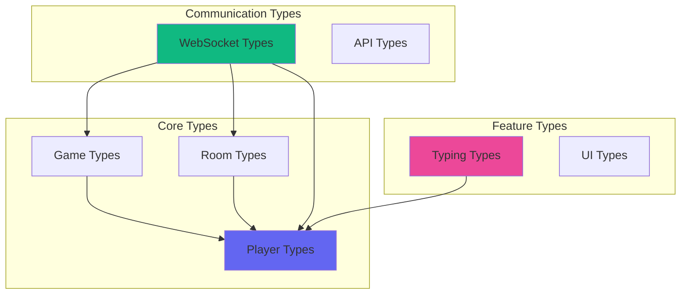
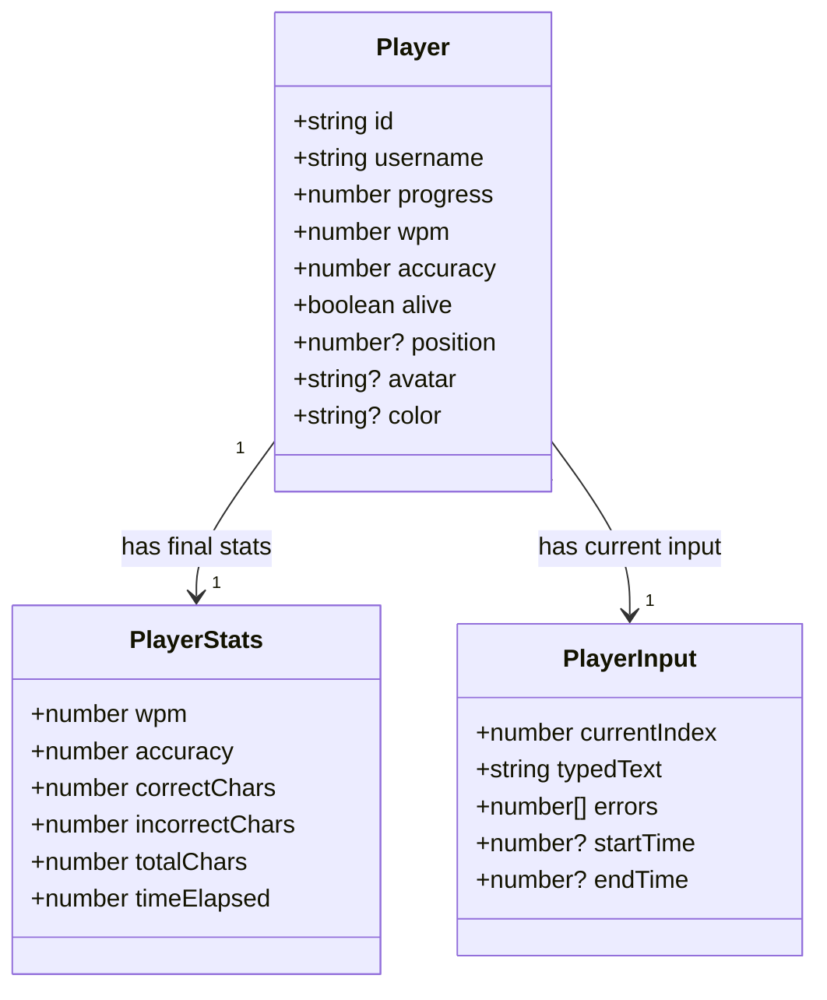
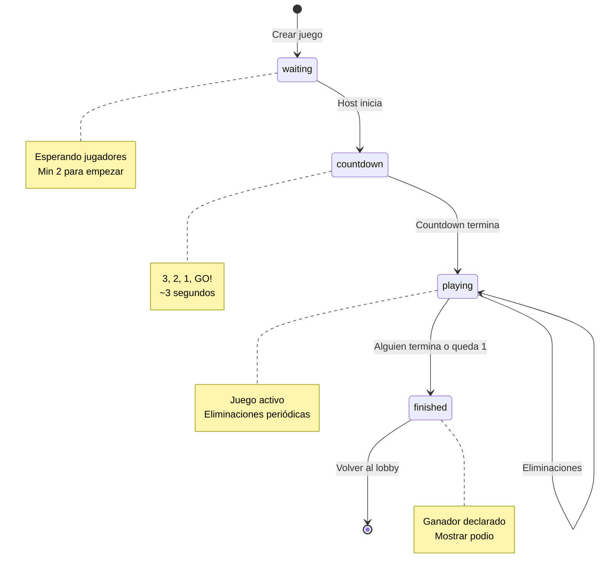
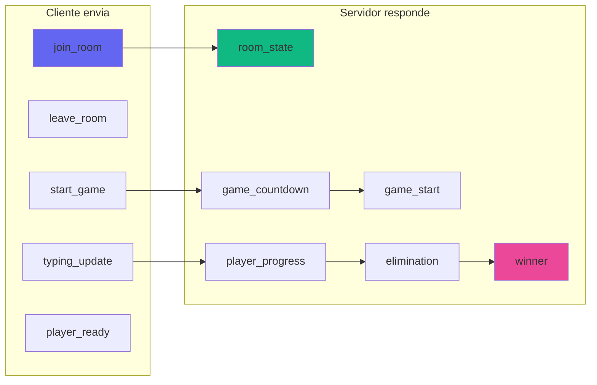
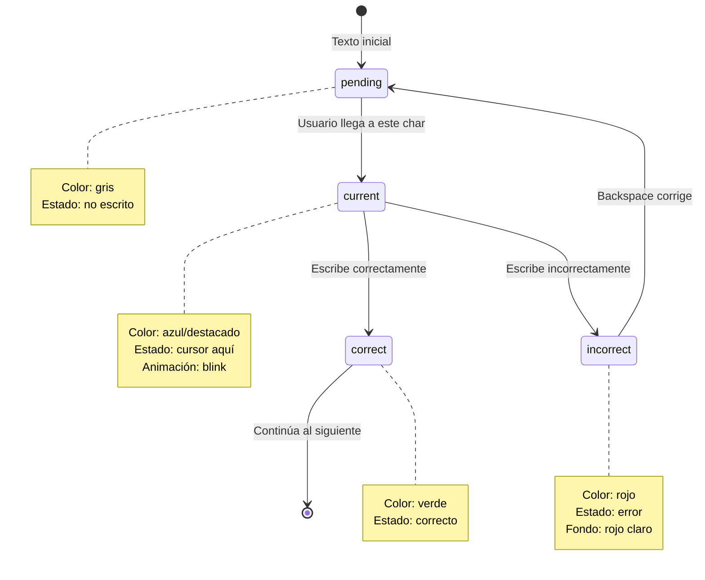
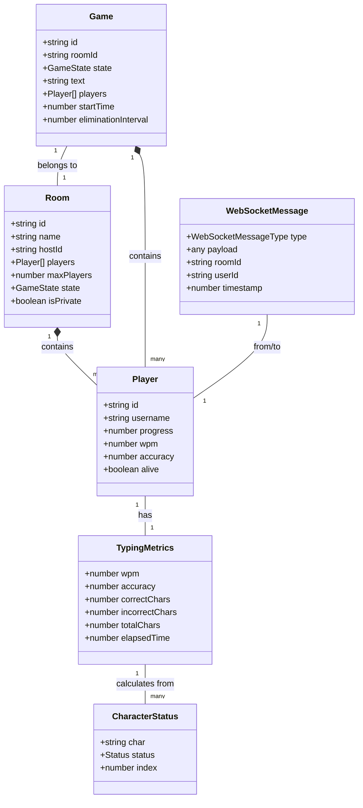

```markdown
# 🔷 Sistema de Types

## Visión General

El sistema de tipos de TypeScript proporciona type safety completo en toda la aplicación, previniendo errores en tiempo de compilación y mejorando la experiencia de desarrollo con autocompletado inteligente.

## Arquitectura de Types



## Player Types

### Definiciones principales

```typescript
// src/types/player.types.ts

export interface Player {
  id: string;                    // Identificador único del jugador
  username: string;              // Nombre visible del jugador
  progress: number;              // Progreso en el texto (0-100)
  wpm: number;                   // Palabras por minuto
  accuracy: number;              // Precisión (0-100)
  alive: boolean;                // Si está activo en el juego
  position?: number;             // Posición en el ranking
  avatar?: string;               // URL del avatar (opcional)
  color?: string;                // Color único para identificar visualmente
}

export interface PlayerStats {
  wpm: number;                   // Palabras por minuto finales
  accuracy: number;              // Precisión final
  correctChars: number;          // Caracteres correctos
  incorrectChars: number;        // Caracteres incorrectos
  totalChars: number;            // Total de caracteres escritos
  timeElapsed: number;           // Tiempo total en segundos
}

export interface PlayerInput {
  currentIndex: number;          // Índice actual en el texto
  typedText: string;             // Texto escrito hasta ahora
  errors: number[];              // Array de índices con errores
  startTime: number | null;      // Timestamp de inicio
  endTime: number | null;        // Timestamp de finalización
}
```

### Diagrama de relaciones



### Ejemplo de uso

```typescript
// Crear un nuevo jugador
const newPlayer: Player = {
  id: 'player_123',
  username: 'SpeedTyper',
  progress: 0,
  wpm: 0,
  accuracy: 100,
  alive: true,
  color: '#6366f1',
};

// Actualizar progreso
const updatedPlayer: Player = {
  ...newPlayer,
  progress: 45.5,
  wpm: 67,
  accuracy: 98.2,
};

// Stats finales
const finalStats: PlayerStats = {
  wpm: 72,
  accuracy: 97.5,
  correctChars: 458,
  incorrectChars: 12,
  totalChars: 470,
  timeElapsed: 125,
};
```

## Game Types

### Definiciones principales

```typescript
// src/types/game.types.ts

export type GameState = 'waiting' | 'countdown' | 'playing' | 'finished';

export interface Game {
  id: string;                    // ID único del juego
  roomId: string;                // ID de la sala
  state: GameState;              // Estado actual del juego
  text: string;                  // Texto a escribir
  players: Player[];             // Array de jugadores
  startTime: number | null;      // Timestamp de inicio
  endTime: number | null;        // Timestamp de finalización
  maxPlayers: number;            // Máximo de jugadores
  eliminationInterval: number;   // Segundos entre eliminaciones
  countdownTime?: number;        // Segundos de cuenta regresiva
}

export interface GameSettings {
  maxPlayers: number;            // 2-50
  eliminationInterval: number;   // 10-300 segundos
  textDifficulty: 'easy' | 'medium' | 'hard';
  isPrivate: boolean;
  roomName: string;
}

export interface GameResult {
  winner: Player;                // Jugador ganador
  finalPlayers: Player[];        // Todos los jugadores ordenados
  duration: number;              // Duración total en segundos
  timestamp: number;             // Cuándo terminó
}

export interface EliminationEvent {
  playerId: string;              // ID del jugador eliminado
  username: string;              // Nombre del jugador
  reason: 'slowest' | 'timeout' | 'disconnect';
  timestamp: number;             // Cuándo fue eliminado
}
```

### Máquina de estados del juego



### Type Guards

```typescript
// Verificar si el juego está activo
export const isGameActive = (state: GameState): boolean => {
  return state === 'playing' || state === 'countdown';
};

// Verificar si se puede unir
export const canJoinGame = (game: Game): boolean => {
  return game.state === 'waiting' && 
         game.players.length < game.maxPlayers;
};

// Verificar si se puede iniciar
export const canStartGame = (game: Game, userId: string): boolean => {
  return game.state === 'waiting' &&
         game.players.length >= 2 &&
         game.roomId === userId; // Simplificado, ajustar según lógica real
};
```

## Room Types

### Definiciones principales

```typescript
// src/types/room.types.ts

export interface Room {
  id: string;                    // ID único de la sala
  name: string;                  // Nombre visible
  hostId: string;                // ID del creador
  players: Player[];             // Jugadores en la sala
  maxPlayers: number;            // Límite de jugadores
  currentPlayers: number;        // Jugadores actuales
  state: GameState;              // Estado del juego en la sala
  isPrivate: boolean;            // Si requiere contraseña
  createdAt: number;             // Timestamp de creación
}

export interface RoomListItem {
  id: string;                    // ID de la sala
  name: string;                  // Nombre de la sala
  currentPlayers: number;        // Jugadores actuales
  maxPlayers: number;            // Máximo permitido
  state: GameState;              // Estado actual
  isPrivate: boolean;            // Si es privada
}

export interface CreateRoomRequest {
  name: string;                  // Nombre de la sala
  maxPlayers: number;            // 2-50
  eliminationInterval: number;   // 10-300 segundos
  isPrivate: boolean;            // Si requiere contraseña
  password?: string;             // Contraseña (si isPrivate)
}

export interface JoinRoomRequest {
  roomId: string;                // ID de la sala
  username: string;              // Nombre del jugador
  password?: string;             // Contraseña (si es privada)
}
```

### Validación de tipos

```typescript
// Validar CreateRoomRequest
export const isValidCreateRoomRequest = (
  req: CreateRoomRequest
): boolean => {
  return req.name.length >= 3 &&
         req.name.length <= 50 &&
         req.maxPlayers >= 2 &&
         req.maxPlayers <= 50 &&
         req.eliminationInterval >= 10 &&
         req.eliminationInterval <= 300 &&
         (!req.isPrivate || (req.password && req.password.length >= 4));
};

// Validar JoinRoomRequest
export const isValidJoinRoomRequest = (
  req: JoinRoomRequest
): boolean => {
  return req.roomId.length > 0 &&
         req.username.length >= 3 &&
         req.username.length <= 20;
};
```

## WebSocket Types

### Message Types

```typescript
// src/types/websocket.types.ts

export type WebSocketMessageType =
  | 'join_room'           // Unirse a sala
  | 'leave_room'          // Salir de sala
  | 'room_state'          // Estado de la sala
  | 'start_game'          // Iniciar juego
  | 'game_start'          // Juego iniciado
  | 'game_countdown'      // Cuenta regresiva
  | 'typing_update'       // Actualización de escritura
  | 'player_progress'     // Progreso de jugador
  | 'elimination'         // Jugador eliminado
  | 'winner'              // Ganador declarado
  | 'player_joined'       // Jugador se unió
  | 'player_left'         // Jugador se fue
  | 'player_ready'        // Jugador listo
  | 'chat_message'        // Mensaje de chat
  | 'error'               // Error
  | 'ping'                // Heartbeat ping
  | 'pong';               // Heartbeat pong

export interface WebSocketMessage<T = any> {
  type: WebSocketMessageType;   // Tipo de mensaje
  payload: T;                    // Datos del mensaje
  roomId?: string;               // ID de sala (opcional)
  userId?: string;               // ID de usuario (opcional)
  timestamp: number;             // Timestamp del mensaje
}
```

### Payloads específicos

```typescript
// Payloads para cada tipo de mensaje

export interface JoinRoomPayload {
  roomId: string;
  username: string;
  password?: string;
}

export interface LeaveRoomPayload {
  roomId: string;
}

export interface RoomStatePayload {
  room: Room;
  game: Game;
}

export interface GameStartPayload {
  startTime: number;
  text: string;
}

export interface GameCountdownPayload {
  countdown: number;              // 3, 2, 1, 0
}

export interface TypingUpdatePayload {
  progress: number;               // 0-100
  wpm: number;                    // Palabras por minuto
  accuracy: number;               // 0-100
  currentIndex: number;           // Posición en el texto
}

export interface PlayerProgressPayload {
  playerId: string;
  progress: number;
  wpm: number;
  accuracy: number;
  alive: boolean;
}

export interface EliminationPayload {
  player: Player;
  reason: string;
  remainingPlayers: number;
}

export interface WinnerPayload {
  winner: Player;
  stats: PlayerStats;
  finalPlayers: Player[];
}

export interface PlayerJoinedPayload {
  player: Player;
  totalPlayers: number;
}

export interface PlayerLeftPayload {
  playerId: string;
  username: string;
  totalPlayers: number;
}

export interface PlayerReadyPayload {
  ready: boolean;
}

export interface ChatMessagePayload {
  message: string;
  playerId?: string;
  username?: string;
  timestamp?: number;
}

export interface ErrorPayload {
  message: string;
  code?: string;
}
```

### Connection Status

```typescript
export type ConnectionStatus = 
  | 'connecting'     // Intentando conectar
  | 'connected'      // Conectado exitosamente
  | 'disconnected'   // Desconectado
  | 'error';         // Error de conexión

export interface WebSocketState {
  status: ConnectionStatus;
  error: string | null;
  reconnectAttempts: number;
  lastPing: number | null;
}
```

### Diagrama de flujo de mensajes



## Typing Types

### Definiciones principales

```typescript
// src/types/typing.types.ts

export interface CharacterStatus {
  char: string;                   // El carácter
  status: 'pending' | 'correct' | 'incorrect' | 'current';
  index: number;                  // Posición en el texto
}

export interface TypingMetrics {
  wpm: number;                    // Palabras por minuto
  rawWpm: number;                 // WPM sin penalización
  accuracy: number;               // Precisión (0-100)
  correctChars: number;           // Caracteres correctos
  incorrectChars: number;         // Caracteres incorrectos
  totalChars: number;             // Total escritos
  elapsedTime: number;            // Tiempo transcurrido (segundos)
}

export interface KeystrokeData {
  key: string;                    // Tecla presionada
  timestamp: number;              // Cuándo se presionó
  isCorrect: boolean;             // Si fue correcta
  expectedChar: string;           // Carácter esperado
}

export interface TypingSession {
  startTime: number | null;       // Inicio de la sesión
  endTime: number | null;         // Fin de la sesión
  text: string;                   // Texto completo
  currentIndex: number;           // Índice actual
  typedChars: string[];           // Caracteres escritos
  keystrokes: KeystrokeData[];    // Historial de teclas
  errors: Set<number>;            // Índices con errores
}
```

```markdown

### Visualización de estados de caracteres



### Ejemplo de uso en componente

```typescript
// Uso de CharacterStatus en TypingArea
const TypingAreaExample: React.FC = () => {
  const text = "Hello World";
  const currentIndex = 6;
  const errors = new Set([4]); // Error en 'o'
  
  const characterStatuses: CharacterStatus[] = text.split('').map((char, index) => ({
    char,
    index,
    status: 
      index < currentIndex 
        ? errors.has(index) 
          ? 'incorrect' 
          : 'correct'
        : index === currentIndex 
          ? 'current' 
          : 'pending'
  }));
  
  // characterStatuses:
  // [
  //   { char: 'H', index: 0, status: 'correct' },
  //   { char: 'e', index: 1, status: 'correct' },
  //   { char: 'l', index: 2, status: 'correct' },
  //   { char: 'l', index: 3, status: 'correct' },
  //   { char: 'o', index: 4, status: 'incorrect' },
  //   { char: ' ', index: 5, status: 'correct' },
  //   { char: 'W', index: 6, status: 'current' },
  //   { char: 'o', index: 7, status: 'pending' },
  //   { char: 'r', index: 8, status: 'pending' },
  //   { char: 'l', index: 9, status: 'pending' },
  //   { char: 'd', index: 10, status: 'pending' },
  // ]
};
```

## Utility Types

### Tipos derivados y helpers

```typescript
// Partial types para actualizaciones
export type PartialPlayer = Partial<Player>;
export type PartialGame = Partial<Game>;

// Pick types para vistas específicas
export type PlayerListItemData = Pick<Player, 'id' | 'username' | 'progress' | 'wpm' | 'alive'>;
export type RoomCardData = Pick<Room, 'id' | 'name' | 'currentPlayers' | 'maxPlayers' | 'state'>;

// Omit types para crear nuevos objetos
export type CreatePlayerData = Omit<Player, 'id' | 'progress' | 'wpm' | 'accuracy'>;
export type UpdatePlayerData = Omit<Player, 'id' | 'username'>;

// Union types para estados
export type ActiveGameState = Extract<GameState, 'playing' | 'countdown'>;
export type InactiveGameState = Exclude<GameState, 'playing' | 'countdown'>;

// Record types para mapeos
export type PlayersById = Record<string, Player>;
export type RoomsById = Record<string, Room>;

// Array types
export type PlayerArray = Player[];
export type MessageArray = WebSocketMessage[];
```

### Tipos genéricos

```typescript
// Respuesta genérica de API
export interface ApiResponse<T> {
  success: boolean;
  data?: T;
  error?: string;
  timestamp: number;
}

// Uso:
// ApiResponse<Room>
// ApiResponse<Player[]>
// ApiResponse<GameResult>

// Estado genérico de carga
export interface LoadingState<T> {
  data: T | null;
  loading: boolean;
  error: string | null;
}

// Uso en componentes:
// const [rooms, setRooms] = useState<LoadingState<Room[]>>({
//   data: null,
//   loading: true,
//   error: null
// });

// Callback genérico
export type Callback<T = void> = (data: T) => void;
export type AsyncCallback<T = void> = (data: T) => Promise<void>;

// Event handler genérico
export type EventHandler<T = any> = (event: T) => void;
```

## Type Assertions y Narrowing

### Type Guards personalizados

```typescript
// Verificar si es un Player válido
export const isPlayer = (obj: any): obj is Player => {
  return (
    typeof obj === 'object' &&
    typeof obj.id === 'string' &&
    typeof obj.username === 'string' &&
    typeof obj.progress === 'number' &&
    typeof obj.wpm === 'number' &&
    typeof obj.accuracy === 'number' &&
    typeof obj.alive === 'boolean'
  );
};

// Verificar tipo de mensaje WebSocket
export const isWebSocketMessage = (obj: any): obj is WebSocketMessage => {
  return (
    typeof obj === 'object' &&
    typeof obj.type === 'string' &&
    'payload' in obj &&
    typeof obj.timestamp === 'number'
  );
};

// Type narrowing con discriminated unions
export type GameEvent = 
  | { type: 'start'; data: GameStartPayload }
  | { type: 'elimination'; data: EliminationPayload }
  | { type: 'winner'; data: WinnerPayload };

export const handleGameEvent = (event: GameEvent) => {
  switch (event.type) {
    case 'start':
      // TypeScript sabe que event.data es GameStartPayload
      console.log('Game starting at', event.data.startTime);
      break;
    case 'elimination':
      // TypeScript sabe que event.data es EliminationPayload
      console.log('Player eliminated:', event.data.player.username);
      break;
    case 'winner':
      // TypeScript sabe que event.data es WinnerPayload
      console.log('Winner:', event.data.winner.username);
      break;
  }
};
```

### Assertions seguras

```typescript
// Usar tipo más específico cuando estamos seguros
const player = getPlayer(id) as Player; // ⚠️ Peligroso
const player = getPlayer(id)!; // ⚠️ Non-null assertion

// Mejor: usar type guard
const maybePlayer = getPlayer(id);
if (isPlayer(maybePlayer)) {
  // TypeScript sabe que es Player aquí
  console.log(maybePlayer.username);
}

// O usar optional chaining
const username = getPlayer(id)?.username ?? 'Unknown';
```

## Enums vs Union Types

### Comparación

```typescript
// ❌ Enum (genera código JavaScript extra)
enum GameStateEnum {
  Waiting = 'waiting',
  Countdown = 'countdown',
  Playing = 'playing',
  Finished = 'finished',
}

// ✅ Union Type (preferido - no genera código)
type GameState = 'waiting' | 'countdown' | 'playing' | 'finished';

// ✅ Con const para valores
const GAME_STATES = {
  WAITING: 'waiting',
  COUNTDOWN: 'countdown',
  PLAYING: 'playing',
  FINISHED: 'finished',
} as const;

type GameState = typeof GAME_STATES[keyof typeof GAME_STATES];
```

### Razones para preferir Union Types

| Aspecto | Enum | Union Type |
|---------|------|------------|
| **Tamaño del bundle** | Genera código JS | Solo tipos (0 KB) |
| **Tree shaking** | Difícil | Perfecto |
| **Type safety** | Bueno | Excelente |
| **Autocompletado** | Sí | Sí |
| **Compatibilidad** | Requiere configuración | Natural |

## Documentación con JSDoc

### Tipos documentados

```typescript
/**
 * Representa un jugador en el juego
 * @interface Player
 * @property {string} id - Identificador único del jugador
 * @property {string} username - Nombre visible del jugador (3-20 caracteres)
 * @property {number} progress - Progreso en el texto (0-100)
 * @property {number} wpm - Palabras por minuto actual
 * @property {number} accuracy - Precisión porcentual (0-100)
 * @property {boolean} alive - Si el jugador sigue en el juego
 * 
 * @example
 * const player: Player = {
 *   id: 'player_123',
 *   username: 'SpeedTyper',
 *   progress: 45.5,
 *   wpm: 67,
 *   accuracy: 98.2,
 *   alive: true
 * };
 */
export interface Player {
  id: string;
  username: string;
  progress: number;
  wpm: number;
  accuracy: number;
  alive: boolean;
  position?: number;
  avatar?: string;
  color?: string;
}

/**
 * Calcula las palabras por minuto
 * @param {number} correctChars - Número de caracteres correctos
 * @param {number} timeInSeconds - Tiempo transcurrido en segundos
 * @returns {number} Palabras por minuto redondeadas
 * 
 * @example
 * const wpm = calculateWPM(250, 60); // 50 WPM
 */
export const calculateWPM = (
  correctChars: number,
  timeInSeconds: number
): number => {
  if (timeInSeconds === 0) return 0;
  const timeInMinutes = timeInSeconds / 60;
  const words = correctChars / 5;
  return Math.round(words / timeInMinutes);
};
```

## Diagrama Completo de Relaciones



## Type Testing

### Tipos de prueba

```typescript
// src/types/__tests__/player.types.test.ts

import { Player, isPlayer } from '../player.types';

describe('Player Types', () => {
  describe('isPlayer type guard', () => {
    it('should return true for valid player', () => {
      const validPlayer = {
        id: 'player_1',
        username: 'Test',
        progress: 50,
        wpm: 60,
        accuracy: 95,
        alive: true,
      };
      
      expect(isPlayer(validPlayer)).toBe(true);
    });
    
    it('should return false for invalid player', () => {
      const invalidPlayer = {
        id: 'player_1',
        username: 'Test',
        // missing required fields
      };
      
      expect(isPlayer(invalidPlayer)).toBe(false);
    });
  });
});
```

## Best Practices

### ✅ Recomendaciones

```typescript
// ✅ Usar interfaces para objetos
interface Player {
  id: string;
  username: string;
}

// ✅ Usar type para unions y aliases
type GameState = 'waiting' | 'playing' | 'finished';
type PlayerOrNull = Player | null;

// ✅ Preferir readonly cuando sea apropiado
interface Config {
  readonly apiUrl: string;
  readonly wsUrl: string;
}

// ✅ Usar optional chaining
const username = player?.username ?? 'Unknown';

// ✅ Tipos estrictos en funciones
const updatePlayer = (
  id: string,
  updates: Partial<Player>
): Player => {
  // implementación
};

// ✅ Evitar 'any', usar 'unknown' si es necesario
const parseData = (data: unknown): Player => {
  if (isPlayer(data)) {
    return data;
  }
  throw new Error('Invalid player data');
};
```

### ❌ Anti-patterns

```typescript
// ❌ Usar 'any' sin razón
const player: any = getData();

// ❌ Type assertion sin validación
const player = getData() as Player;

// ❌ Interfaces con nombres genéricos
interface Data {
  value: string;
}

// ❌ Tipos demasiado amplios
type AnyFunction = (...args: any[]) => any;

// ❌ Duplicar definiciones
interface Player1 { ... }
interface Player2 { ... } // Mismos campos
```

## Migración y Evolución de Types

### Versionado de tipos

```typescript
// v1 - Versión inicial
export interface PlayerV1 {
  id: string;
  username: string;
  score: number;
}

// v2 - Versión mejorada
export interface Player {
  id: string;
  username: string;
  progress: number; // Antes era 'score'
  wpm: number;      // Nuevo campo
  accuracy: number; // Nuevo campo
  alive: boolean;   // Nuevo campo
}

// Migration helper
export const migratePlayerV1ToV2 = (oldPlayer: PlayerV1): Player => {
  return {
    ...oldPlayer,
    progress: oldPlayer.score,
    wpm: 0,
    accuracy: 100,
    alive: true,
  };
};
```

## Próximos Pasos

Documentos relacionados:
- [Utilities](./05-utilities.md) - Funciones que usan estos types
- [Services Layer](./06-services.md) - Comunicación con tipos
- [Custom Hooks](./07-hooks.md) - Hooks que consumen estos types
- [WebSocket y Tiempo Real](./11-websocket.md) - Mensajería tipada

## Resumen

El sistema de types proporciona:

1. **Type Safety**: Previene errores en tiempo de compilación
2. **Autocompletado**: Mejor experiencia de desarrollo
3. **Documentación**: Los tipos sirven como documentación viva
4. **Refactoring**: Cambios seguros y rastreables
5. **Scalability**: Fácil evolución del proyecto  
6. **Team Collaboration**: Contratos claros entre desarrolladores

**Siguiente documento**: [Utilities](./05-utilities.md) - Funciones que usan estos types intensivamente.