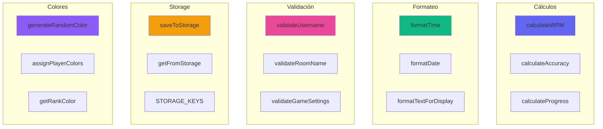
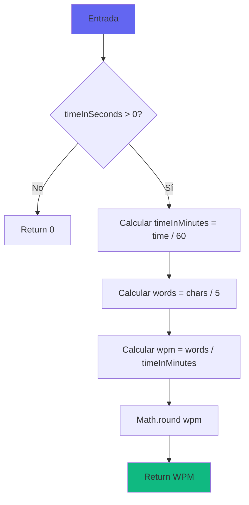
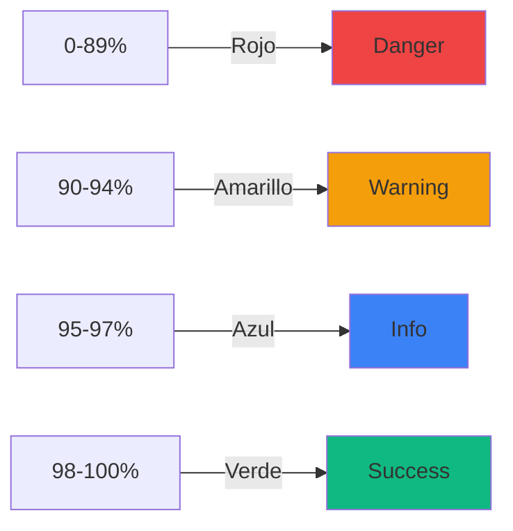
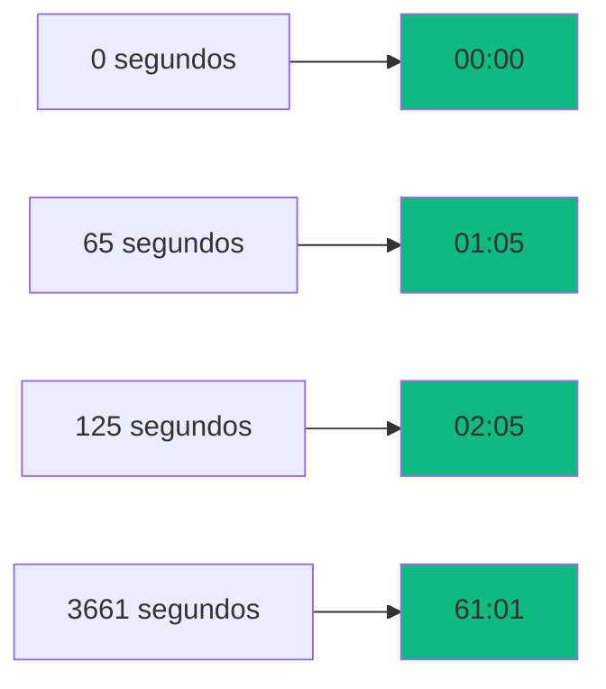
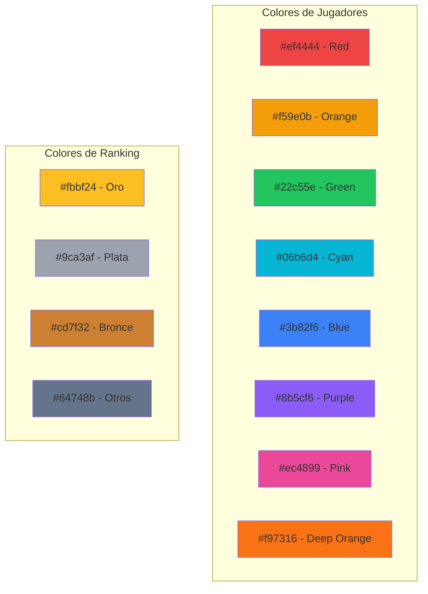
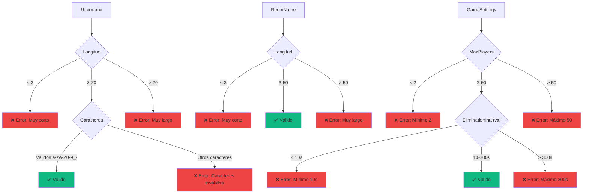
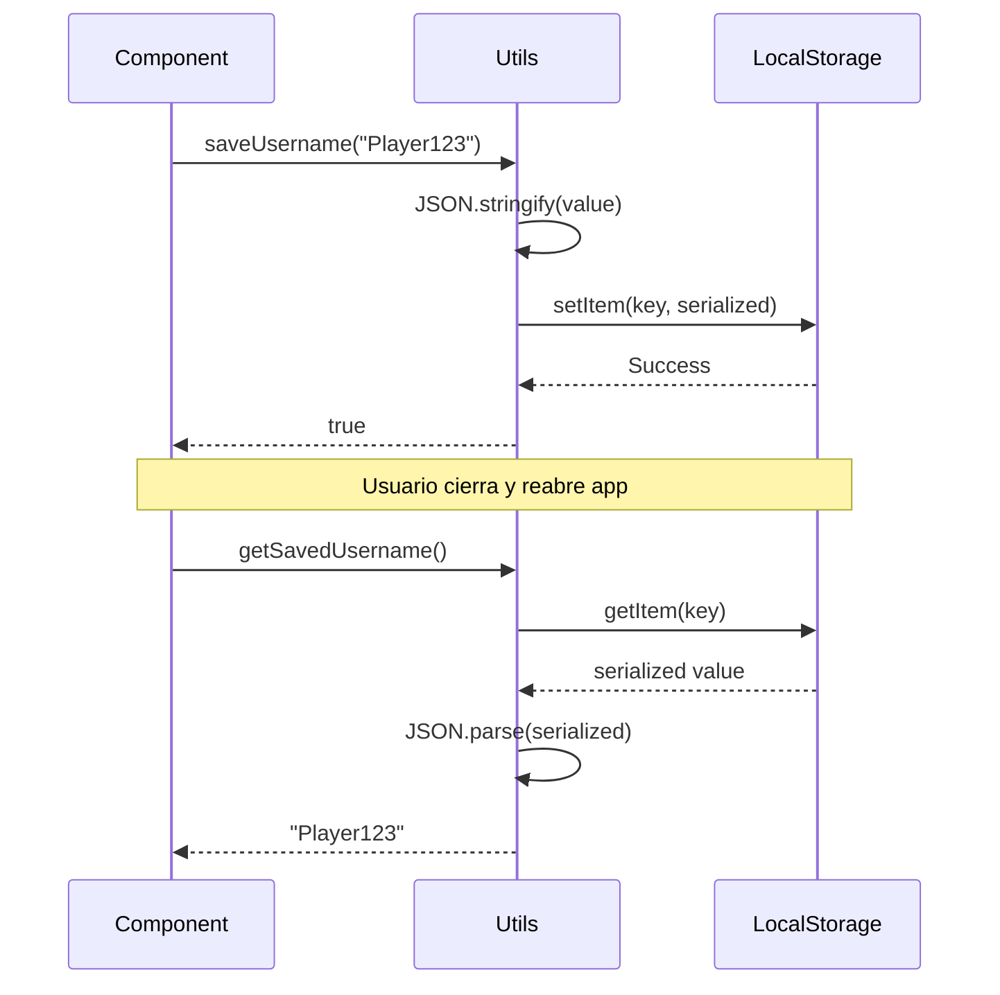
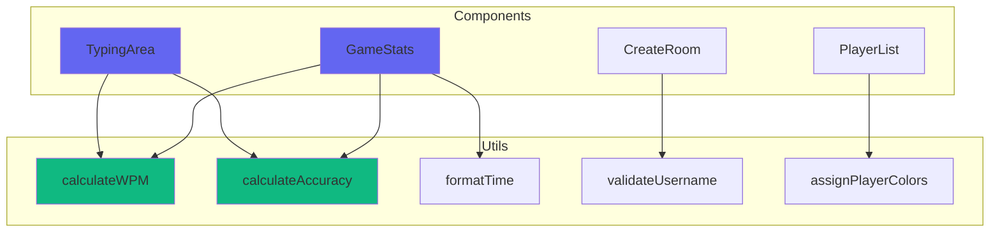

```markdown
# 🛠️ Utilities y Funciones Auxiliares

## Visión General

Las utilidades son funciones puras, reutilizables y testeables que proporcionan funcionalidad común a través de toda la
aplicación. Están organizadas por categoría y no tienen dependencias de React o estado.

## Organización de Utilities



## Utilities de Cálculo

### calculateWPM.ts - Palabras por Minuto

#### Funciones principales

```typescript
/**
 * Calcula las palabras por minuto (WPM)
 * Formula: (caracteres correctos / 5) / (tiempo en minutos)
 * @param correctChars - Caracteres escritos correctamente
 * @param timeInSeconds - Tiempo transcurrido en segundos
 * @returns WPM redondeado
 */
export const calculateWPM = (
        correctChars: number,
        timeInSeconds: number
    ): number => {
        if (timeInSeconds === 0) return 0;

        const timeInMinutes = timeInSeconds / 60;
        const words = correctChars / 5; // Promedio de caracteres por palabra
        const wpm = words / timeInMinutes;

        return Math.round(wpm);
    };

/**
 * Calcula el WPM "crudo" sin penalización por errores
 * @param totalChars - Total de caracteres escritos (incluye errores)
 * @param timeInSeconds - Tiempo transcurrido
 * @returns WPM bruto redondeado
 */
export const calculateRawWPM = (
    totalChars: number,
    timeInSeconds: number
): number => {
    if (timeInSeconds === 0) return 0;

    const timeInMinutes = timeInSeconds / 60;
    const words = totalChars / 5;
    const rawWpm = words / timeInMinutes;

    return Math.round(rawWpm);
};

/**
 * Calcula el WPM en tiempo real mientras el usuario escribe
 * Incluye protección contra valores muy tempranos
 * @param currentIndex - Posición actual en el texto
 * @param startTime - Timestamp de inicio (o null si no ha empezado)
 * @param errors - Número de errores cometidos
 * @returns WPM actual o 0 si es muy temprano
 */
export const calculateLiveWPM = (
    currentIndex: number,
    startTime: number | null,
    errors: number = 0
): number => {
    if (!startTime || currentIndex === 0) return 0;

    const elapsedSeconds = (Date.now() - startTime) / 1000;

    // No calcular WPM si han pasado menos de 2 segundos
    // Evita valores inflados al inicio
    if (elapsedSeconds < 2) return 0;

    const correctChars = Math.max(0, currentIndex - errors);

    return calculateWPM(correctChars, elapsedSeconds);
};
```

#### Diagrama de cálculo



#### Ejemplos de uso

```typescript
// Ejemplo 1: Cálculo básico
const wpm = calculateWPM(250, 60);
console.log(wpm); // 50 WPM
// 250 caracteres correctos en 60 segundos
// (250 / 5) / (60 / 60) = 50 palabras/minuto

// Ejemplo 2: Con errores
const correctChars = 300;
const totalChars = 320;
const errors = totalChars - correctChars; // 20 errores
const timeInSeconds = 90;

const netWPM = calculateWPM(correctChars, timeInSeconds);
const rawWPM = calculateRawWPM(totalChars, timeInSeconds);

console.log(netWPM); // 40 WPM (con penalización)
console.log(rawWPM); // 42.7 WPM (sin penalización)

// Ejemplo 3: En tiempo real
const currentIndex = 150;
const startTime = Date.now() - 30000; // Empezó hace 30 segundos
const errors = 5;

const liveWPM = calculateLiveWPM(currentIndex, startTime, errors);
console.log(liveWPM); // ~58 WPM
```

#### Tests

```typescript
describe('calculateWPM', () => {
    it('should return 0 for 0 seconds', () => {
        expect(calculateWPM(100, 0)).toBe(0);
    });

    it('should calculate correct WPM', () => {
        expect(calculateWPM(250, 60)).toBe(50);
        expect(calculateWPM(500, 120)).toBe(50);
    });

    it('should round WPM', () => {
        expect(calculateWPM(247, 60)).toBe(49); // 49.4 -> 49
        expect(calculateWPM(253, 60)).toBe(51); // 50.6 -> 51
    });
});
```

### calculateAccuracy.ts - Precisión

#### Funciones principales

```typescript
/**
 * Calcula la precisión como porcentaje
 * Formula: (caracteres correctos / total caracteres) * 100
 * @param correctChars - Número de caracteres correctos
 * @param totalChars - Total de caracteres escritos
 * @returns Precisión con 1 decimal
 */
export const calculateAccuracy = (
        correctChars: number,
        totalChars: number
    ): number => {
        if (totalChars === 0) return 100;

        const accuracy = (correctChars / totalChars) * 100;

        // Redondear a 1 decimal: 98.234 -> 98.2
        return Math.round(accuracy * 10) / 10;
    };

/**
 * Calcula la precisión basándose en el número de errores
 * @param totalChars - Total de caracteres escritos
 * @param errors - Número de errores cometidos
 * @returns Precisión porcentual
 */
export const calculateAccuracyFromErrors = (
    totalChars: number,
    errors: number
): number => {
    if (totalChars === 0) return 100;

    const correctChars = totalChars - errors;
    return calculateAccuracy(correctChars, totalChars);
};

/**
 * Determina si la precisión es "buena" según estándares
 * @param accuracy - Precisión a evaluar
 * @returns true si accuracy >= 95%
 */
export const isGoodAccuracy = (accuracy: number): boolean => {
    return accuracy >= 95;
};

/**
 * Obtiene el color CSS asociado a un nivel de precisión
 * @param accuracy - Precisión (0-100)
 * @returns Variable CSS del color
 */
export const getAccuracyColor = (accuracy: number): string => {
    if (accuracy >= 98) return 'var(--color-success)';  // Verde
    if (accuracy >= 95) return 'var(--color-info)';     // Azul
    if (accuracy >= 90) return 'var(--color-warning)';  // Amarillo
    return 'var(--color-danger)';                        // Rojo
};
```

#### Escala de colores



#### Ejemplos de uso

```typescript
// Ejemplo 1: Cálculo básico
const accuracy = calculateAccuracy(95, 100);
console.log(accuracy); // 95.0%

// Ejemplo 2: Con errores
const totalChars = 500;
const errors = 15;
const accuracyFromErrors = calculateAccuracyFromErrors(totalChars, errors);
console.log(accuracyFromErrors); // 97.0%

// Ejemplo 3: Evaluación de calidad
console.log(isGoodAccuracy(98.5)); // true
console.log(isGoodAccuracy(92.0)); // false

// Ejemplo 4: Color dinámico
const color1 = getAccuracyColor(99.2); // var(--color-success)
const color2 = getAccuracyColor(93.5); // var(--color-warning)
const color3 = getAccuracyColor(87.0); // var(--color-danger)
```

#### Uso en componentes

```typescript
const GameStats: React.FC<{ accuracy: number }> = ({accuracy}) => {
    return (
        <div className = {styles.stat} >
        <span className = {styles.label} > Precisión < /span>
            < span
    className = {styles.value}
    style = {
    {
        color: getAccuracyColor(accuracy)
    }
}
>
    {
        accuracy.toFixed(1)
    }
%
    </span>
    {
        isGoodAccuracy(accuracy) && <span>✓</span>}
    < /div>
    )
        ;
    }
    ;
```

## Utilities de Texto

### textUtils.ts - Manipulación de Textos

#### Textos de ejemplo

```typescript
/**
 * Textos de ejemplo organizados por dificultad
 */
const SAMPLE_TEXTS = {
        easy: [
            'El rápido zorro marrón salta sobre el perro perezoso. Los gatos duermen todo el día.',
            'La programación es divertida cuando aprendes paso a paso. Cada día mejoras más.',
            'Me gusta escribir código limpio y bien organizado. Es importante ser ordenado.',
        ],
        medium: [
            'En el desarrollo web moderno, React se ha convertido en una de las bibliotecas más populares para crear interfaces de usuario interactivas y dinámicas.',
            'TypeScript añade tipado estático a JavaScript, lo que ayuda a prevenir errores y mejora la experiencia de desarrollo con mejor autocompletado.',
            'La arquitectura de software es crucial para proyectos escalables. Una buena estructura facilita el mantenimiento y la colaboración.',
        ],
        hard: [
            'La complejidad algorítmica, expresada en notación Big O, describe cómo el tiempo de ejecución o el espacio requerido crecen relativamente al tamaño de la entrada.',
            'WebSockets proporcionan comunicación bidireccional full-duplex sobre una única conexión TCP, permitiendo aplicaciones en tiempo real eficientes.',
            'El patrón Observer define una dependencia uno-a-muchos entre objetos, de modo que cuando un objeto cambia su estado, todos sus dependientes son notificados automáticamente.',
        ],
    };
```

#### Funciones principales

```typescript
/**
 * Obtiene un texto aleatorio según la dificultad
 * @param difficulty - Nivel de dificultad
 * @returns Texto aleatorio de esa dificultad
 */
export const getRandomText = (
        difficulty: 'easy' | 'medium' | 'hard' = 'medium'
    ): string => {
        const texts = SAMPLE_TEXTS[difficulty];
        const randomIndex = Math.floor(Math.random() * texts.length);
        return texts[randomIndex];
    };

/**
 * Valida si un carácter escrito coincide con el esperado
 * @param typed - Carácter escrito por el usuario
 * @param expected - Carácter esperado
 * @returns true si coinciden exactamente
 */
export const isCharacterCorrect = (
    typed: string,
    expected: string
): boolean => {
    return typed === expected;
};

/**
 * Calcula el progreso como porcentaje
 * @param currentIndex - Posición actual
 * @param totalLength - Longitud total del texto
 * @returns Progreso (0-100) con 1 decimal
 */
export const calculateProgress = (
    currentIndex: number,
    totalLength: number
): number => {
    if (totalLength === 0) return 0;

    const progress = (currentIndex / totalLength) * 100;

    return Math.min(100, Math.round(progress * 10) / 10);
};

/**
 * Formatea el texto para mostrar caracteres especiales visualmente
 * @param text - Texto a formatear
 * @returns Texto con espacios y saltos visibles
 */
export const formatTextForDisplay = (text: string): string => {
    return text
        .replace(/ /g, '·')      // Espacios visibles: ·
        .replace(/\n/g, '↵\n');  // Saltos de línea visibles: ↵
};

/**
 * Cuenta cuántas palabras hay en un texto
 * @param text - Texto a analizar
 * @returns Número de palabras
 */
export const countWords = (text: string): number => {
    return text.trim().split(/\s+/).length;
};

/**
 * Obtiene una vista previa del texto
 * @param text - Texto completo
 * @param maxLength - Longitud máxima de la preview
 * @returns Texto truncado con "..."
 */
export const getTextPreview = (
    text: string,
    maxLength: number = 50
): string => {
    if (text.length <= maxLength) return text;
    return text.substring(0, maxLength) + '...';
};

/**
 * Normaliza el texto eliminando espacios extras
 * @param text - Texto a normalizar
 * @returns Texto limpio
 */
export const normalizeText = (text: string): string => {
    return text
        .replace(/\s+/g, ' ')  // Múltiples espacios -> uno solo
        .trim();
};
```

```markdown

#### Ejemplos

```typescript
// Ejemplo 1: Obtener texto aleatorio
const easyText = getRandomText('easy');
const mediumText = getRandomText('medium');
const hardText = getRandomText('hard');

// Ejemplo 2: Validar caracteres
console.log(isCharacterCorrect('a', 'a')); // true
console.log(isCharacterCorrect('A', 'a')); // false - case sensitive
console.log(isCharacterCorrect(' ', ' ')); // true

// Ejemplo 3: Calcular progreso
const progress = calculateProgress(250, 500);
console.log(progress); // 50.0%

// Ejemplo 4: Formatear para display
const text = "Hello World\nNew line";
const formatted = formatTextForDisplay(text);
console.log(formatted); // "Hello·World↵\nNew·line"

// Ejemplo 5: Contar palabras
const words = countWords("The quick brown fox");
console.log(words); // 4

// Ejemplo 6: Preview
const longText = "Este es un texto muy largo que necesita ser truncado";
const preview = getTextPreview(longText, 20);
console.log(preview); // "Este es un texto muy..."

// Ejemplo 7: Normalizar
const messy = "  Multiple   spaces    here  ";
const clean = normalizeText(messy);
console.log(clean); // "Multiple spaces here"
```

## Utilities de Tiempo

### timeUtils.ts - Formateo de Tiempo

#### Funciones principales

```typescript
/**
 * Formatea segundos a formato MM:SS
 * @param seconds - Segundos totales
 * @returns String en formato "00:00"
 */
export const formatTime = (seconds: number): string => {
        const mins = Math.floor(seconds / 60);
        const secs = seconds % 60;

        return `${mins.toString().padStart(2, '0')}:${secs.toString().padStart(2, '0')}`;
    };

/**
 * Formatea milisegundos a formato legible
 * @param ms - Milisegundos
 * @returns String en formato "MM:SS"
 */
export const formatMilliseconds = (ms: number): string => {
    const seconds = Math.floor(ms / 1000);
    return formatTime(seconds);
};

/**
 * Calcula el tiempo transcurrido desde un timestamp
 * @param startTime - Timestamp de inicio (o null)
 * @returns Segundos transcurridos
 */
export const getElapsedTime = (startTime: number | null): number => {
    if (!startTime) return 0;
    return Math.floor((Date.now() - startTime) / 1000);
};

/**
 * Calcula el tiempo transcurrido en milisegundos
 * @param startTime - Timestamp de inicio (o null)
 * @returns Milisegundos transcurridos
 */
export const getElapsedTimeMs = (startTime: number | null): number => {
    if (!startTime) return 0;
    return Date.now() - startTime;
};

/**
 * Formatea una fecha a formato legible en español
 * @param timestamp - Timestamp a formatear
 * @returns String con fecha formateada
 */
export const formatDate = (timestamp: number): string => {
    const date = new Date(timestamp);
    return date.toLocaleDateString('es-ES', {
        year: 'numeric',
        month: 'long',
        day: 'numeric',
        hour: '2-digit',
        minute: '2-digit',
    });
};

/**
 * Obtiene el tiempo restante hasta una fecha futura
 * @param futureTime - Timestamp futuro
 * @returns Segundos restantes (mínimo 0)
 */
export const getTimeRemaining = (futureTime: number): number => {
    const remaining = futureTime - Date.now();
    return Math.max(0, Math.floor(remaining / 1000));
};
```

#### Ejemplos de formato de tiempo



#### Ejemplos de uso

```typescript
// Ejemplo 1: Formatear tiempo
console.log(formatTime(0));     // "00:00"
console.log(formatTime(65));    // "01:05"
console.log(formatTime(125));   // "02:05"
console.log(formatTime(3661));  // "61:01"

// Ejemplo 2: Formatear milisegundos
console.log(formatMilliseconds(65000));  // "01:05"
console.log(formatMilliseconds(125500)); // "02:05"

// Ejemplo 3: Tiempo transcurrido
const startTime = Date.now() - 45000; // Hace 45 segundos
const elapsed = getElapsedTime(startTime);
console.log(elapsed); // 45
console.log(formatTime(elapsed)); // "00:45"

// Ejemplo 4: Formatear fecha
const timestamp = 1703001234567;
console.log(formatDate(timestamp));
// "19 de diciembre de 2023, 12:13"

// Ejemplo 5: Tiempo restante
const futureTime = Date.now() + 10000; // En 10 segundos
const remaining = getTimeRemaining(futureTime);
console.log(remaining); // ~10

// Ejemplo 6: Uso en componente
const Timer: React.FC = () => {
    const [elapsed, setElapsed] = useState(0);
    const startTime = useRef(Date.now());

    useEffect(() => {
        const interval = setInterval(() => {
            setElapsed(getElapsedTime(startTime.current));
        }, 1000);

        return () => clearInterval(interval);
    }, []);

    return <div>{formatTime(elapsed)} < /div>;
};
```

## Utilities de Color

### colorUtils.ts - Gestión de Colores

#### Funciones principales

```typescript
/**
 * Genera un color aleatorio de una paleta predefinida
 * @returns Color en formato hex
 */
export const generateRandomColor = (): string => {
        const colors = [
            '#ef4444', // red
            '#f59e0b', // orange
            '#eab308', // yellow
            '#22c55e', // green
            '#06b6d4', // cyan
            '#3b82f6', // blue
            '#8b5cf6', // purple
            '#ec4899', // pink
        ];

        return colors[Math.floor(Math.random() * colors.length)];
    };

/**
 * Asigna colores únicos a jugadores
 * @param playerCount - Número de jugadores
 * @returns Array de colores hex
 */
export const assignPlayerColors = (playerCount: number): string[] => {
    const baseColors = [
        '#ef4444', // red
        '#f59e0b', // orange
        '#22c55e', // green
        '#06b6d4', // cyan
        '#3b82f6', // blue
        '#8b5cf6', // purple
        '#ec4899', // pink
        '#f97316', // deep orange
    ];

    const colors: string[] = [];

    for (let i = 0; i < playerCount; i++) {
        colors.push(baseColors[i % baseColors.length]);
    }

    return colors;
};

/**
 * Convierte hex a rgba con transparencia
 * @param hex - Color en formato hex (#rrggbb)
 * @param alpha - Valor de transparencia (0-1)
 * @returns Color en formato rgba
 */
export const hexToRgba = (hex: string, alpha: number = 1): string => {
    const r = parseInt(hex.slice(1, 3), 16);
    const g = parseInt(hex.slice(3, 5), 16);
    const b = parseInt(hex.slice(5, 7), 16);

    return `rgba(${r}, ${g}, ${b}, ${alpha})`;
};

/**
 * Obtiene el color según la posición en el ranking
 * @param position - Posición del jugador (1, 2, 3, etc.)
 * @returns Color hex correspondiente
 */
export const getRankColor = (position: number): string => {
    switch (position) {
        case 1:
            return '#fbbf24'; // Oro
        case 2:
            return '#9ca3af'; // Plata
        case 3:
            return '#cd7f32'; // Bronce
        default:
            return '#64748b'; // Gris
    }
};
```

#### Paleta de colores



#### Ejemplos de uso

```typescript
// Ejemplo 1: Color aleatorio
const randomColor = generateRandomColor();
console.log(randomColor); // "#3b82f6" (aleatorio)

// Ejemplo 2: Asignar colores a jugadores
const colors = assignPlayerColors(5);
console.log(colors);
// ["#ef4444", "#f59e0b", "#22c55e", "#06b6d4", "#3b82f6"]

// Ejemplo 3: Convertir a RGBA
const rgba = hexToRgba('#3b82f6', 0.5);
console.log(rgba); // "rgba(59, 130, 246, 0.5)"

// Ejemplo 4: Colores de ranking
console.log(getRankColor(1)); // "#fbbf24" (oro)
console.log(getRankColor(2)); // "#9ca3af" (plata)
console.log(getRankColor(3)); // "#cd7f32" (bronce)
console.log(getRankColor(4)); // "#64748b" (gris)

// Ejemplo 5: Uso en componente
const PlayerAvatar: React.FC<{ player: Player; rank: number }> = ({player, rank}) => {
    return (
        <div
            style = {
    {
        backgroundColor: player.color,
            border
    :
        `3px solid ${getRankColor(rank)}`,
            boxShadow
    :
        `0 0 20px ${hexToRgba(player.color, 0.5)}`
    }
}
>
    {
        player.username[0]
    }
    </div>
)
    ;
};
```

## Utilities de Validación

### validationUtils.ts - Validaciones

#### Funciones principales

```typescript
/**
 * Valida el nombre de usuario
 * @param username - Nombre a validar
 * @returns Objeto con validación y error (si hay)
 */
export const validateUsername = (username: string): {
        valid: boolean;
        error?: string;
    } => {
        if (!username || username.trim().length === 0) {
            return {valid: false, error: 'El nombre de usuario es requerido'};
        }

        if (username.length < 3) {
            return {valid: false, error: 'El nombre debe tener al menos 3 caracteres'};
        }

        if (username.length > 20) {
            return {valid: false, error: 'El nombre no puede tener más de 20 caracteres'};
        }

        if (!/^[a-zA-Z0-9_-]+$/.test(username)) {
            return {
                valid: false,
                error: 'Solo se permiten letras, números, guiones y guiones bajos',
            };
        }

        return {valid: true};
    };

/**
 * Valida el nombre de la sala
 * @param roomName - Nombre a validar
 * @returns Objeto con validación y error (si hay)
 */
export const validateRoomName = (roomName: string): {
    valid: boolean;
    error?: string;
} => {
    if (!roomName || roomName.trim().length === 0) {
        return {valid: false, error: 'El nombre de la sala es requerido'};
    }

    if (roomName.length < 3) {
        return {valid: false, error: 'El nombre debe tener al menos 3 caracteres'};
    }

    if (roomName.length > 50) {
        return {valid: false, error: 'El nombre no puede tener más de 50 caracteres'};
    }

    return {valid: true};
};

/**
 * Valida la configuración del juego
 * @param settings - Configuración a validar
 * @returns Objeto con validación y error (si hay)
 */
export const validateGameSettings = (settings: {
    maxPlayers: number;
    eliminationInterval: number;
}): {
    valid: boolean;
    error?: string;
} => {
    if (settings.maxPlayers < 2) {
        return {valid: false, error: 'Debe haber al menos 2 jugadores'};
    }

    if (settings.maxPlayers > 50) {
        return {valid: false, error: 'No puede haber más de 50 jugadores'};
    }

    if (settings.eliminationInterval < 10) {
        return {valid: false, error: 'El intervalo de eliminación debe ser al menos 10 segundos'};
    }

    if (settings.eliminationInterval > 300) {
        return {valid: false, error: 'El intervalo de eliminación no puede ser mayor a 5 minutos'};
    }

    return {valid: true};
};
```

```markdown

#### Reglas de validación



#### Ejemplos de uso

```typescript
// Ejemplo 1: Validar username
const result1 = validateUsername('Player123');
console.log(result1); // { valid: true }

const result2 = validateUsername('ab');
console.log(result2);
// { valid: false, error: 'El nombre debe tener al menos 3 caracteres' }

const result3 = validateUsername('Player@123');
console.log(result3);
// { valid: false, error: 'Solo se permiten letras, números, guiones y guiones bajos' }

// Ejemplo 2: Validar room name
const roomResult = validateRoomName('Mi Sala Épica');
console.log(roomResult); // { valid: true }

// Ejemplo 3: Validar game settings
const settingsResult = validateGameSettings({
    maxPlayers: 10,
    eliminationInterval: 30
});
console.log(settingsResult); // { valid: true }

// Ejemplo 4: Uso en componente
const CreateRoomForm: React.FC = () => {
    const [roomName, setRoomName] = useState('');
    const [error, setError] = useState('');

    const handleSubmit = () => {
        const validation = validateRoomName(roomName);

        if (!validation.valid) {
            setError(validation.error!);
            return;
        }

        // Proceder con la creación
        createRoom(roomName);
    };

    return (
        <div>
            <input
                value = {roomName}
    onChange = {(e)
=>
    setRoomName(e.target.value)
}
    />
    {
        error && <span className = "error" > {error} < /span>}
            < button
        onClick = {handleSubmit} > Crear < /button>
            < /div>
    )
        ;
    }
    ;
```

## Utilities de Storage

### storageUtils.ts - Persistencia Local

#### Funciones principales

```typescript
/**
 * Guarda datos en localStorage con manejo de errores
 * @param key - Clave de almacenamiento
 * @param value - Valor a guardar (será serializado a JSON)
 * @returns true si tuvo éxito, false si falló
 */
export const saveToStorage = <T>(key: string, value: T): boolean => {
        try {
            const serialized = JSON.stringify(value);
            localStorage.setItem(key, serialized);
            return true;
        } catch (error) {
            console.error('Error saving to localStorage:', error);
            return false;
        }
    };

/**
 * Obtiene datos de localStorage con manejo de errores
 * @param key - Clave de almacenamiento
 * @returns Valor deserializado o null si no existe/falla
 */
export const getFromStorage = <T>(key: string): T | null => {
    try {
        const serialized = localStorage.getItem(key);
        if (serialized === null) return null;
        return JSON.parse(serialized) as T;
    } catch (error) {
        console.error('Error reading from localStorage:', error);
        return null;
    }
};

/**
 * Elimina un item de localStorage
 * @param key - Clave a eliminar
 * @returns true si tuvo éxito
 */
export const removeFromStorage = (key: string): boolean => {
    try {
        localStorage.removeItem(key);
        return true;
    } catch (error) {
        console.error('Error removing from localStorage:', error);
        return false;
    }
};

/**
 * Limpia todo el localStorage
 * @returns true si tuvo éxito
 */
export const clearStorage = (): boolean => {
    try {
        localStorage.clear();
        return true;
    } catch (error) {
        console.error('Error clearing localStorage:', error);
        return false;
    }
};

/**
 * Constantes de claves de almacenamiento
 */
export const STORAGE_KEYS = {
    USERNAME: 'typing_br_username',
    USER_ID: 'typing_br_user_id',
    SETTINGS: 'typing_br_settings',
    STATS: 'typing_br_stats',
    LAST_ROOM: 'typing_br_last_room',
} as const;

/**
 * Guarda el nombre de usuario
 */
export const saveUsername = (username: string): boolean => {
    return saveToStorage(STORAGE_KEYS.USERNAME, username);
};

/**
 * Obtiene el nombre de usuario guardado
 */
export const getSavedUsername = (): string | null => {
    return getFromStorage<string>(STORAGE_KEYS.USERNAME);
};

/**
 * Guarda el ID del usuario
 */
export const saveUserId = (userId: string): boolean => {
    return saveToStorage(STORAGE_KEYS.USER_ID, userId);
};

/**
 * Obtiene el ID del usuario guardado
 */
export const getSavedUserId = (): string | null => {
    return getFromStorage<string>(STORAGE_KEYS.USER_ID);
};
```

#### Flujo de persistencia



#### Ejemplos de uso

```typescript
// Ejemplo 1: Guardar y recuperar string
saveUsername('Player123');
const username = getSavedUsername();
console.log(username); // "Player123"

// Ejemplo 2: Guardar y recuperar objeto complejo
interface UserSettings {
    theme: 'light' | 'dark';
    soundEnabled: boolean;
    volume: number;
}

const settings: UserSettings = {
    theme: 'dark',
    soundEnabled: true,
    volume: 0.7
};

saveToStorage(STORAGE_KEYS.SETTINGS, settings);
const savedSettings = getFromStorage<UserSettings>(STORAGE_KEYS.SETTINGS);
console.log(savedSettings?.theme); // "dark"

// Ejemplo 3: Manejo de errores
const success = saveToStorage('my_key', {data: 'value'});
if (!success) {
    console.error('Failed to save data');
}

// Ejemplo 4: Uso en UserContext
const UserContext = () => {
    const [username, setUsername] = useState<string | null>(null);

    // Cargar al montar
    useEffect(() => {
        const saved = getSavedUsername();
        if (saved) {
            setUsername(saved);
        }
    }, []);

    // Guardar al cambiar
    const updateUsername = (newUsername: string) => {
        setUsername(newUsername);
        saveUsername(newUsername);
    };

    return {username, updateUsername};
};
```

## Testing de Utilities

### Estructura de tests

```typescript
// src/utils/__tests__/calculateWPM.test.ts

describe('calculateWPM', () => {
    describe('edge cases', () => {
        it('should return 0 for 0 seconds', () => {
            expect(calculateWPM(100, 0)).toBe(0);
        });

        it('should return 0 for 0 characters', () => {
            expect(calculateWPM(0, 60)).toBe(0);
        });
    });

    describe('normal cases', () => {
        it('should calculate correct WPM', () => {
            expect(calculateWPM(250, 60)).toBe(50);
            expect(calculateWPM(500, 120)).toBe(50);
            expect(calculateWPM(125, 30)).toBe(50);
        });

        it('should round WPM to nearest integer', () => {
            expect(calculateWPM(247, 60)).toBe(49); // 49.4
            expect(calculateWPM(253, 60)).toBe(51); // 50.6
        });
    });

    describe('high performance', () => {
        it('should handle high WPM correctly', () => {
            expect(calculateWPM(1000, 60)).toBe(200);
        });
    });
});

// src/utils/__tests__/validationUtils.test.ts

describe('validateUsername', () => {
    it('should accept valid usernames', () => {
        expect(validateUsername('Player123').valid).toBe(true);
        expect(validateUsername('user_name').valid).toBe(true);
        expect(validateUsername('user-name').valid).toBe(true);
    });

    it('should reject too short usernames', () => {
        const result = validateUsername('ab');
        expect(result.valid).toBe(false);
        expect(result.error).toContain('al menos 3 caracteres');
    });

    it('should reject too long usernames', () => {
        const result = validateUsername('a'.repeat(21));
        expect(result.valid).toBe(false);
        expect(result.error).toContain('más de 20 caracteres');
    });

    it('should reject invalid characters', () => {
        const result = validateUsername('user@123');
        expect(result.valid).toBe(false);
        expect(result.error).toContain('Solo se permiten');
    });
});
```

## Performance de Utilities

### Benchmarks

```typescript
// Benchmark de funciones críticas

console.time('calculateWPM x 10000');
for (let i = 0; i < 10000; i++) {
    calculateWPM(250, 60);
}
console.timeEnd('calculateWPM x 10000');
// Resultado: ~2ms (muy rápido)

console.time('validateUsername x 10000');
for (let i = 0; i < 10000; i++) {
    validateUsername('Player123');
}
console.timeEnd('validateUsername x 10000');
// Resultado: ~15ms (rápido)

console.time('formatTime x 10000');
for (let i = 0; i < 10000; i++) {
    formatTime(125);
}
console.timeEnd('formatTime x 10000');
// Resultado: ~5ms (muy rápido)
```

### Comparación de performance

| Función             | Ejecuciones | Tiempo | Performance   |
|---------------------|-------------|--------|---------------|
| `calculateWPM`      | 10,000      | ~2ms   | ⚡⚡⚡ Excelente |
| `calculateAccuracy` | 10,000      | ~2ms   | ⚡⚡⚡ Excelente |
| `formatTime`        | 10,000      | ~5ms   | ⚡⚡⚡ Excelente |
| `validateUsername`  | 10,000      | ~15ms  | ⚡⚡ Muy bueno  |
| `getRandomText`     | 10,000      | ~3ms   | ⚡⚡⚡ Excelente |

### Optimizaciones

```typescript
// ❌ Ineficiente - recalcula cada vez
const getPlayerColor = (playerId: string) => {
    const colors = assignPlayerColors(10); // Recalcula todo
    return colors[parseInt(playerId) % colors.length];
};

// ✅ Eficiente - cachea el resultado
const colorCache = new Map<number, string[]>();

const getPlayerColorsOptimized = (playerCount: number): string[] => {
    if (colorCache.has(playerCount)) {
        return colorCache.get(playerCount)!;
    }

    const colors = assignPlayerColors(playerCount);
    colorCache.set(playerCount, colors);
    return colors;
};

// ❌ Ineficiente - regex en cada llamada
const validateEmail = (email: string): boolean => {
    const regex = /^[^\s@]+@[^\s@]+\.[^\s@]+$/; // Crea regex cada vez
    return regex.test(email);
};

// ✅ Eficiente - regex compilado una vez
const EMAIL_REGEX = /^[^\s@]+@[^\s@]+\.[^\s@]+$/;

const validateEmailOptimized = (email: string): boolean => {
    return EMAIL_REGEX.test(email);
};
```

## Documentación de Funciones

### Template de documentación

```typescript
/**
 * [Descripción breve de lo que hace la función]
 *
 * [Descripción detallada si es necesario, explicando el propósito,
 * algoritmo utilizado, consideraciones especiales, etc.]
 *
 * @param param1 - Descripción del parámetro 1
 * @param param2 - Descripción del parámetro 2 (opcional si tiene valor por defecto)
 * @returns Descripción del valor de retorno y su significado
 *
 * @example
 * const result = myFunction(arg1, arg2);
 * console.log(result); // valor esperado
 *
 * @throws {ErrorType} Descripción de cuándo lanza error (si aplica)
 *
 * @see {@link RelatedFunction} para funcionalidad relacionada
 */
export const myFunction = (param1: type1, param2: type2 = defaultValue): returnType => {
        // Implementación
    };
```

### Ejemplo real

```typescript
/**
 * Calcula las palabras por minuto (WPM) basándose en caracteres correctos y tiempo
 *
 * Utiliza la fórmula estándar de mecanografía donde se asume que una palabra
 * promedio tiene 5 caracteres. El resultado se redondea al entero más cercano
 * para facilitar la visualización.
 *
 * Formula: (caracteres correctos / 5) / (tiempo en minutos)
 *
 * @param correctChars - Número de caracteres escritos correctamente (sin errores)
 * @param timeInSeconds - Tiempo transcurrido en segundos desde que empezó a escribir
 * @returns WPM redondeado al entero más cercano, o 0 si el tiempo es 0
 *
 * @example
 * // Usuario escribió 250 caracteres correctos en 60 segundos
 * const wpm = calculateWPM(250, 60);
 * console.log(wpm); // 50
 *
 * // Usuario escribió 125 caracteres en 30 segundos
 * const wpm2 = calculateWPM(125, 30);
 * console.log(wpm2); // 50
 *
 * @see {@link calculateRawWPM} para WPM sin penalización por errores
 * @see {@link calculateLiveWPM} para cálculo en tiempo real
 */
export const calculateWPM = (
        correctChars: number,
        timeInSeconds: number
    ): number => {
        if (timeInSeconds === 0) return 0;

        const timeInMinutes = timeInSeconds / 60;
        const words = correctChars / 5;
        const wpm = words / timeInMinutes;

        return Math.round(wpm);
    };
```

## Mejores Prácticas

### ✅ Recomendaciones

```typescript
// ✅ 1. Funciones puras - mismo input, mismo output, sin side effects
export const calculateWPM = (chars: number, time: number): number => {
    // No modifica variables externas
    // No hace llamadas a APIs
    // Siempre retorna el mismo resultado para los mismos inputs
    if (time === 0) return 0;
    return Math.round((chars / 5) / (time / 60));
};

// ✅ 2. Manejo de edge cases
export const safeDivide = (a: number, b: number): number => {
    if (b === 0) return 0; // Previene división por cero
    if (!isFinite(a) || !isFinite(b)) return 0; // Previene NaN/Infinity
    return a / b;
};

// ✅ 3. Type safety completo
export const formatValue = <T extends string | number>(
    value: T,
    formatter: (v: T) => string
): string => {
    return formatter(value);
};

// ✅ 4. Nombres descriptivos
export const calculatePlayerAccuracyPercentage = (
    correctChars: number,
    totalChars: number
): number => {
    // Nombre largo pero claro sobre qué hace
    if (totalChars === 0) return 100;
    return Math.round((correctChars / totalChars) * 100 * 10) / 10;
};

// ✅ 5. Documentación completa
/**
 * Valida un email usando expresión regular estándar
 * @param email - Email a validar
 * @returns true si el formato es válido, false si no
 */
export const isValidEmail = (email: string): boolean => {
    const EMAIL_REGEX = /^[^\s@]+@[^\s@]+\.[^\s@]+$/;
    return EMAIL_REGEX.test(email);
};

// ✅ 6. Tests comprehensivos
describe('isValidEmail', () => {
    it('should accept valid emails', () => {
        expect(isValidEmail('test@example.com')).toBe(true);
        expect(isValidEmail('user.name@domain.co.uk')).toBe(true);
    });

    it('should reject invalid emails', () => {
        expect(isValidEmail('invalid')).toBe(false);
        expect(isValidEmail('@example.com')).toBe(false);
        expect(isValidEmail('user@')).toBe(false);
    });
});

// ✅ 7. Constantes fuera de funciones para mejor performance
const CHARS_PER_WORD = 5;
const SECONDS_PER_MINUTE = 60;

export const calculateWPMOptimized = (chars: number, time: number): number => {
    if (time === 0) return 0;
    return Math.round((chars / CHARS_PER_WORD) / (time / SECONDS_PER_MINUTE));
};

// ✅ 8. Uso de early returns para claridad
export const getDiscountedPrice = (price: number, discount: number): number => {
    if (price <= 0) return 0;
    if (discount <= 0) return price;
    if (discount >= 100) return 0;

    return price * (1 - discount / 100);
};
```

### ❌ Anti-patterns

```typescript
// ❌ 1. Función con side effects
let globalCounter = 0;
export const incrementCounter = () => {
    globalCounter++; // Modifica estado global - NO PURO
    return globalCounter;
};

// ❌ 2. Sin manejo de errores
export const divide = (a: number, b: number): number => {
    return a / b; // Puede dar Infinity o NaN
};

// ❌ 3. Tipos any
export const processData = (data: any): any => {
    return data.value; // Sin type safety
};

// ❌ 4. Sin documentación
export const xyz = (a, b) => a + b; // Qué hace? Qué son a y b?

// ❌ 5. Funciones muy largas
export const doEverything = (data) => {
    // 200 líneas de código haciendo múltiples cosas
    // Difícil de testear y mantener
};

// ❌ 6. Mutación de parámetros
export const addToArray = (arr: number[], value: number): number[] => {
    arr.push(value); // Muta el array original
    return arr;
};

// ✅ Mejor: crear nuevo array
export const addToArrayImmutable = (arr: number[], value: number): number[] => {
    return [...arr, value]; // Inmutable
};

// ❌ 7. Lógica compleja sin extraer
export const validateUser = (user) => {
    if (user.name.length >= 3 && user.name.length <= 20 && /^[a-zA-Z0-9_-]+$/.test(user.name) &&
        user.email.includes('@') && user.age >= 18) {
        return true;
    }
    return false;
};

// ✅ Mejor: extraer validaciones
const isValidUsername = (name: string): boolean =>
    name.length >= 3 && name.length <= 20 && /^[a-zA-Z0-9_-]+$/.test(name);

const isValidEmail = (email: string): boolean =>
    email.includes('@') && email.includes('.');

const isAdult = (age: number): boolean =>
    age >= 18;

export const validateUser = (user: User): boolean => {
    return isValidUsername(user.name) &&
        isValidEmail(user.email) &&
        isAdult(user.age);
};
```

## Composición de Funciones

### Funciones pequeñas y componibles

```typescript
// Funciones básicas
const add = (a: number) => (b: number) => a + b;
const multiply = (a: number) => (b: number) => a * b;
const subtract = (a: number) => (b: number) => b - a;

// Composición
const add5 = add(5);
const multiplyBy2 = multiply(2);

console.log(add5(10)); // 15
console.log(multiplyBy2(5)); // 10

// Pipe pattern
const pipe = <T>(...fns: Array<(arg: T) => T>) => (value: T): T =>
    fns.reduce((acc, fn) => fn(acc), value);

// Uso
const transform = pipe(
    add5,
    multiplyBy2,
    subtract(3)
);

console.log(transform(10)); // (10 + 5) * 2 - 3 = 27
```

### Ejemplo aplicado al proyecto

```typescript
// Funciones de transformación
const normalizeText = (text: string): string =>
    text.trim().replace(/\s+/g, ' ');

const removeSpecialChars = (text: string): string =>
    text.replace(/[^a-zA-Z0-9\s]/g, '');

const toLowerCase = (text: string): string =>
    text.toLowerCase();

// Composición para preparar texto
const prepareTextForComparison = pipe(
    normalizeText,
    removeSpecialChars,
    toLowerCase
);

// Uso
const input = "  Hello,  World!  ";
const prepared = prepareTextForComparison(input);
console.log(prepared); // "hello world"
```

## Resumen de Utilities

### Tabla de referencia rápida

| Categoría      | Función Principal     | Parámetros               | Retorno          | Uso Común                    |
|----------------|-----------------------|--------------------------|------------------|------------------------------|
| **WPM**        | `calculateWPM`        | chars, time              | number           | Calcular palabras por minuto |
| **WPM**        | `calculateLiveWPM`    | index, startTime, errors | number           | WPM en tiempo real           |
| **Accuracy**   | `calculateAccuracy`   | correct, total           | number           | Calcular precisión           |
| **Accuracy**   | `getAccuracyColor`    | accuracy                 | string           | Color según precisión        |
| **Texto**      | `getRandomText`       | difficulty               | string           | Obtener texto para juego     |
| **Texto**      | `calculateProgress`   | current, total           | number           | Calcular progreso %          |
| **Tiempo**     | `formatTime`          | seconds                  | string           | Formatear a MM:SS            |
| **Tiempo**     | `getElapsedTime`      | startTime                | number           | Tiempo transcurrido          |
| **Color**      | `generateRandomColor` | -                        | string           | Color aleatorio hex          |
| **Color**      | `getRankColor`        | position                 | string           | Color según ranking          |
| **Validación** | `validateUsername`    | username                 | ValidationResult | Validar nombre usuario       |
| **Validación** | `validateRoomName`    | roomName                 | ValidationResult | Validar nombre sala          |
| **Storage**    | `saveToStorage`       | key, value               | boolean          | Guardar en localStorage      |
| **Storage**    | `getFromStorage`      | key                      | T \| null        | Obtener de localStorage      |

### Mapa de dependencias



## Cheatsheet de Utilities

### Cálculos rápidos

```typescript
// WPM: caracteres correctos / 5 / minutos
const wpm = calculateWPM(250, 60); // 50 WPM

// Accuracy: correctos / total * 100
const accuracy = calculateAccuracy(95, 100); // 95.0%

// Progress: actual / total * 100
const progress = calculateProgress(50, 100); // 50.0%
```

### Validaciones rápidas

```typescript
// Username: 3-20 chars, alfanumérico + - _
const {valid, error} = validateUsername('Player123');

// Room: 3-50 chars
const roomValid = validateRoomName('Mi Sala').valid;

// Settings: 2-50 players, 10-300s interval
const settingsValid = validateGameSettings({
    maxPlayers: 10,
    eliminationInterval: 30
}).valid;
```

### Storage rápido

```typescript
// Guardar
saveUsername('Player123');
saveUserId('user_abc');

// Recuperar
const username = getSavedUsername();
const userId = getSavedUserId();

// Limpiar
removeFromStorage(STORAGE_KEYS.USERNAME);
```

## Próximos Pasos

Para profundizar en temas relacionados:

- [Services Layer](./06-services.md) - Servicios que usan estas utilities
- [Custom Hooks](./07-hooks.md) - Hooks que consumen estas funciones
- [Testing Guide](./17-testing-guide.md) - Cómo testear utilities

## Conclusión

Las utilities son el fundamento de la aplicación:

✅ **Reutilizables**: Usadas en múltiples lugares  
✅ **Testeables**: Funciones puras fáciles de testear  
✅ **Puras**: Sin side effects, predecibles  
✅ **Documentadas**: Clara documentación JSDoc  
✅ **Type-safe**: Completamente tipadas  
✅ **Performance**: Optimizadas para rendimiento  
✅ **Mantenibles**: Código limpio y bien organizado

**Siguiente documento**: [Services Layer](./06-services.md) - Capa de comunicación con el backend.

