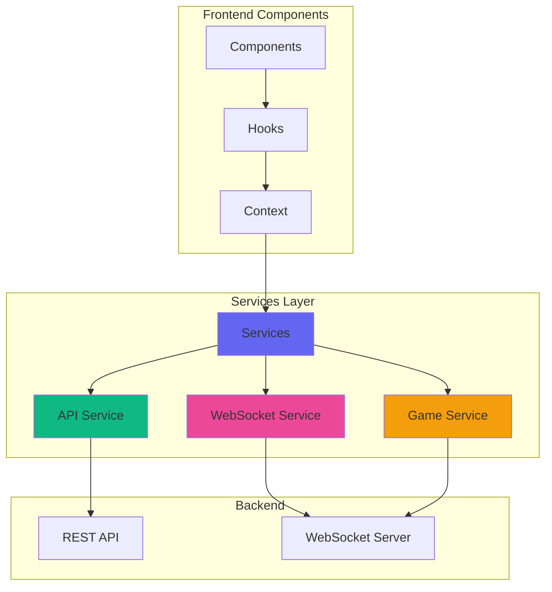
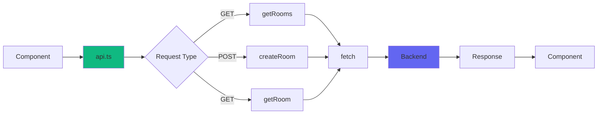
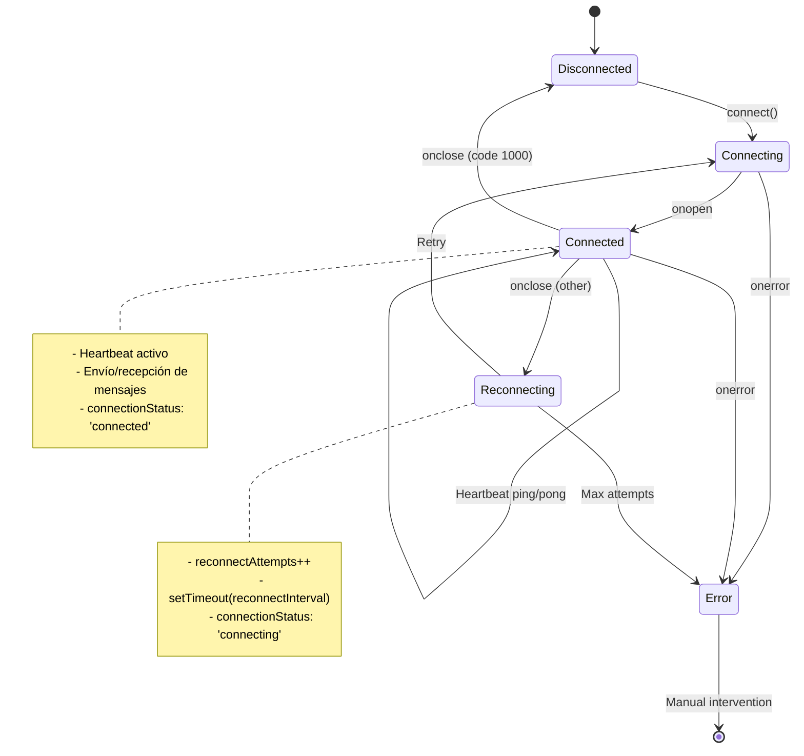
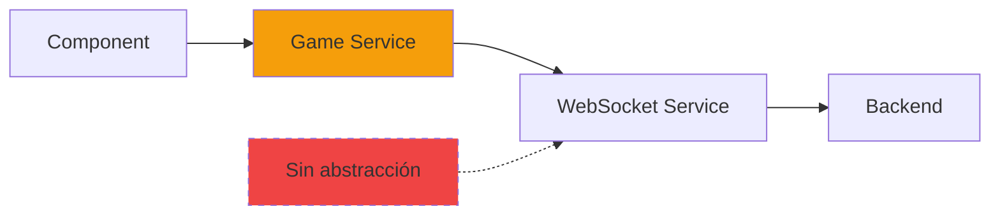
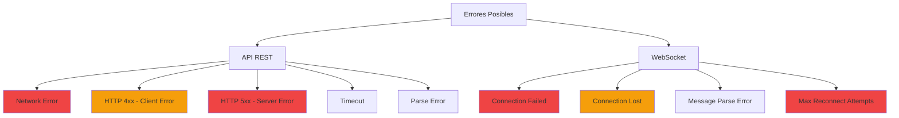

# 🌐 Services Layer - Capa de Comunicación

## Visión General

La capa de servicios actúa como intermediario entre los componentes de React y el backend, encapsulando toda la lógica
de comunicación HTTP y WebSocket. Proporciona una API limpia y consistente para el resto de la aplicación.

## Arquitectura de Services



## Estructura de Services

````
services/ 
    ├── api.ts # API REST (HTTP) 
    ├── websocket.ts # WebSocket con reconexión 
    ├── gameService.ts # Operaciones específicas del juego 
    └── index.ts # Barrel export
````

## API Service (api.ts)

### Propósito

Maneja todas las llamadas HTTP REST al backend para operaciones que no requieren tiempo real, como:

- Listar salas disponibles
- Crear nuevas salas
- Obtener información de una sala
- Health check del servidor

### Estructura del Servicio



### Implementación Completa

```typescript
// src/services/api.ts

import type {
    Room,
    RoomListItem,
    CreateRoomRequest,
} from '../types';

const API_URL = process.env.REACT_APP_API_URL || 'http://localhost:8080/api';

/**
 * Custom error class para errores de API
 */
class ApiError extends Error {
    constructor(
        message: string,
        public status?: number,
        public code?: string
    ) {
        super(message);
        this.name = 'ApiError';
    }
}

/**
 * Wrapper genérico para fetch con manejo de errores
 * @param endpoint - Endpoint relativo (ej: '/rooms')
 * @param options - Opciones de fetch
 * @returns Response deserializado
 * @throws {ApiError} Si la petición falla
 */
const fetchApi = async <T>(
    endpoint: string,
    options?: RequestInit
): Promise<T> => {
    try {
        const response = await fetch(`${API_URL}${endpoint}`, {
            ...options,
            headers: {
                'Content-Type': 'application/json',
                ...options?.headers,
            },
        });

        if (!response.ok) {
            const error = await response.json().catch(() => ({
                message: 'Error desconocido',
            }));

            throw new ApiError(
                error.message || 'Error en la solicitud',
                response.status,
                error.code
            );
        }

        return await response.json();
    } catch (error) {
        if (error instanceof ApiError) {
            throw error;
        }

        // Error de red u otro error no manejado
        throw new ApiError(
            'Error de conexión con el servidor. Por favor verifica tu conexión.'
        );
    }
};

/**
 * Obtiene la lista de salas disponibles
 * @returns Array de salas con información resumida
 * @throws {ApiError} Si falla la petición
 */
export const getRooms = async (): Promise<RoomListItem[]> => {
    return fetchApi<RoomListItem[]>('/rooms');
};

/**
 * Obtiene información detallada de una sala específica
 * @param roomId - ID de la sala
 * @returns Información completa de la sala
 * @throws {ApiError} Si la sala no existe o falla la petición
 */
export const getRoom = async (roomId: string): Promise<Room> => {
    return fetchApi<Room>(`/rooms/${roomId}`);
};

/**
 * Crea una nueva sala de juego
 * @param data - Configuración de la sala
 * @returns Sala creada con toda su información
 * @throws {ApiError} Si los datos son inválidos o falla la creación
 */
export const createRoom = async (
    data: CreateRoomRequest
): Promise<Room> => {
    return fetchApi<Room>('/rooms', {
        method: 'POST',
        body: JSON.stringify(data),
    });
};

/**
 * Verifica si una sala existe
 * @param roomId - ID de la sala a verificar
 * @returns true si existe, false si no
 */
export const checkRoomExists = async (roomId: string): Promise<boolean> => {
    try {
        await getRoom(roomId);
        return true;
    } catch (error) {
        if (error instanceof ApiError && error.status === 404) {
            return false;
        }
        throw error;
    }
};

/**
 * Obtiene estadísticas generales del servidor
 * @returns Estadísticas del servidor
 */
export const getServerStats = async (): Promise<{
    totalRooms: number;
    totalPlayers: number;
    activeGames: number;
}> => {
    return fetchApi('/stats');
};

/**
 * Health check del servidor
 * @returns Estado del servidor
 */
export const healthCheck = async (): Promise<{ status: string }> => {
    return fetchApi('/health');
};

// Exportar clase de error para uso en componentes
export {ApiError};
```

### Flujo de una Petición API

```mermaid
sequenceDiagram
    participant C as Component
    participant API as API Service
    participant F as fetch
    participant B as Backend
    C ->> API: getRooms()
    API ->> F: fetch('/api/rooms')
    F ->> B: GET /api/rooms

    alt Respuesta exitosa (200)
        B ->> F: { rooms: [...] }
        F ->> API: Response OK
        API ->> API: response.json()
        API ->> C: RoomListItem[]
    else Error del servidor (4xx/5xx)
        B ->> F: { error: "..." }
        F ->> API: Response NOT OK
        API ->> API: Throw ApiError
        API ->> C: ❌ ApiError
    else Error de red
        F ->> API: Network Error
        API ->> API: Throw ApiError
        API ->> C: ❌ ApiError
    end
````

```markdown

## WebSocket Service (websocket.ts)

### Propósito

Maneja toda la comunicación en tiempo real con el backend a través de WebSocket. Incluye:

- Conexión y reconexión automática
- Sistema de mensajería tipado
- Heartbeat (ping/pong) para mantener la conexión viva
- Gestión de suscriptores por tipo de mensaje
- Manejo de estados de conexión

### Características Clave

```mermaid
graph TB
    A[WebSocket Service] --> B[Conexión/Reconexión]
    A --> C[Sistema de Mensajería]
    A --> D[Heartbeat]
    A --> E[Gestión de Estado]
    
    B --> B1[Auto-reconexión]
    B --> B2[Max intentos]
    B --> B3[Intervalo configurable]
    
    C --> C1[Envío tipado]
    C --> C2[Suscripción por tipo]
    C --> C3[Handlers múltiples]
    
    D --> D1[Ping cada 30s]
    D --> D2[Detecta desconexión]
    
    E --> E1[connecting]
    E --> E2[connected]
    E --> E3[disconnected]
    E --> E4[error]
    
    style A fill:#ec4899
    style B fill:#10b981
    style C fill:#6366f1
    style D fill:#f59e0b
    style E fill:#8b5cf6
```

### Implementación Completa

```typescript
// src/services/websocket.ts

import type {
    WebSocketMessage,
    WebSocketMessageType,
    ConnectionStatus,
} from '../types';

export type MessageHandler = (message: WebSocketMessage) => void;

export interface WebSocketConfig {
    url: string;
    reconnectInterval?: number;
    maxReconnectAttempts?: number;
    heartbeatInterval?: number;
}

/**
 * Servicio de WebSocket con reconexión automática y gestión de mensajes
 */
export class WebSocketService {
    private ws: WebSocket | null = null;
    private config: Required<WebSocketConfig>;
    private messageHandlers: Map<WebSocketMessageType, Set<MessageHandler>> = new Map();
    private reconnectAttempts: number = 0;
    private reconnectTimeout: NodeJS.Timeout | null = null;
    private heartbeatInterval: NodeJS.Timeout | null = null;
    private connectionStatus: ConnectionStatus = 'disconnected';
    private statusChangeListeners: Set<(status: ConnectionStatus) => void> = new Set();

    constructor(config: WebSocketConfig) {
        this.config = {
            url: config.url,
            reconnectInterval: config.reconnectInterval || 3000,
            maxReconnectAttempts: config.maxReconnectAttempts || 5,
            heartbeatInterval: config.heartbeatInterval || 30000,
        };
    }

    /**
     * Conecta al servidor WebSocket
     */
    connect(): void {
        if (this.ws?.readyState === WebSocket.OPEN) {
            console.log('WebSocket ya está conectado');
            return;
        }

        this.setConnectionStatus('connecting');

        try {
            this.ws = new WebSocket(this.config.url);

            this.ws.onopen = this.handleOpen.bind(this);
            this.ws.onmessage = this.handleMessage.bind(this);
            this.ws.onerror = this.handleError.bind(this);
            this.ws.onclose = this.handleClose.bind(this);
        } catch (error) {
            console.error('Error al conectar WebSocket:', error);
            this.handleReconnect();
        }
    }

    /**
     * Desconecta del servidor
     */
    disconnect(): void {
        this.clearReconnectTimeout();
        this.clearHeartbeat();

        if (this.ws) {
            this.ws.close(1000, 'Desconexión intencional');
            this.ws = null;
        }

        this.setConnectionStatus('disconnected');
    }

    /**
     * Envía un mensaje al servidor
     * @param type - Tipo de mensaje
     * @param payload - Datos del mensaje
     * @param roomId - ID de sala (opcional)
     */
    send<T = any>(type: WebSocketMessageType, payload: T, roomId?: string): void {
        if (!this.isConnected()) {
            console.error('WebSocket no está conectado');
            return;
        }

        const message: WebSocketMessage = {
            type,
            payload,
            roomId,
            timestamp: Date.now(),
        };

        try {
            this.ws!.send(JSON.stringify(message));
            console.log('[WS SEND]', type, payload);
        } catch (error) {
            console.error('Error al enviar mensaje:', error);
        }
    }

    /**
     * Suscribe un handler para un tipo de mensaje específico
     * @param type - Tipo de mensaje a escuchar
     * @param handler - Función a ejecutar cuando llegue el mensaje
     * @returns Función para desuscribirse
     */
    on(type: WebSocketMessageType, handler: MessageHandler): () => void {
        if (!this.messageHandlers.has(type)) {
            this.messageHandlers.set(type, new Set());
        }

        this.messageHandlers.get(type)!.add(handler);

        // Retorna función para desuscribir
        return () => {
            this.messageHandlers.get(type)?.delete(handler);
        };
    }

    /**
     * Suscribe un listener para cambios de estado de conexión
     * @param listener - Función a ejecutar cuando cambie el estado
     * @returns Función para desuscribirse
     */
    onStatusChange(listener: (status: ConnectionStatus) => void): () => void {
        this.statusChangeListeners.add(listener);

        // Retorna función para desuscribir
        return () => {
            this.statusChangeListeners.delete(listener);
        };
    }

    /**
     * Verifica si está conectado
     * @returns true si la conexión está abierta
     */
    isConnected(): boolean {
        return this.ws?.readyState === WebSocket.OPEN;
    }

    /**
     * Obtiene el estado actual de conexión
     * @returns Estado actual
     */
    getConnectionStatus(): ConnectionStatus {
        return this.connectionStatus;
    }

    /**
     * Handler cuando se abre la conexión
     */
    private handleOpen(): void {
        console.log('✅ WebSocket conectado');
        this.reconnectAttempts = 0;
        this.setConnectionStatus('connected');
        this.startHeartbeat();
    }

    /**
     * Handler cuando llega un mensaje
     */
    private handleMessage(event: MessageEvent): void {
        try {
            const message: WebSocketMessage = JSON.parse(event.data);

            console.log('[WS RECEIVE]', message.type, message.payload);

            // Manejar pong (respuesta a heartbeat)
            if (message.type === 'pong') {
                return;
            }

            // Notificar a los handlers suscritos a este tipo
            const handlers = this.messageHandlers.get(message.type);
            if (handlers) {
                handlers.forEach(handler => {
                    try {
                        handler(message);
                    } catch (error) {
                        console.error(`Error en handler de ${message.type}:`, error);
                    }
                });
            }

            // También notificar a handlers genéricos (si existen)
            const genericHandlers = this.messageHandlers.get('*' as WebSocketMessageType);
            if (genericHandlers) {
                genericHandlers.forEach(handler => {
                    try {
                        handler(message);
                    } catch (error) {
                        console.error('Error en handler genérico:', error);
                    }
                });
            }
        } catch (error) {
            console.error('Error al procesar mensaje:', error);
        }
    }

    /**
     * Handler cuando hay un error
     */
    private handleError(error: Event): void {
        console.error('❌ WebSocket error:', error);
        this.setConnectionStatus('error');
    }

    /**
     * Handler cuando se cierra la conexión
     */
    private handleClose(event: CloseEvent): void {
        console.log('🔌 WebSocket cerrado:', event.code, event.reason);
        this.clearHeartbeat();
        this.setConnectionStatus('disconnected');

        // Intentar reconectar si no fue cierre intencional
        if (event.code !== 1000) {
            this.handleReconnect();
        }
    }

    /**
     * Maneja la reconexión automática
     */
    private handleReconnect(): void {
        if (this.reconnectAttempts >= this.config.maxReconnectAttempts) {
            console.error('❌ Máximo de intentos de reconexión alcanzado');
            this.setConnectionStatus('error');
            return;
        }

        this.reconnectAttempts++;
        console.log(
            `🔄 Intentando reconectar (${this.reconnectAttempts}/${this.config.maxReconnectAttempts})...`
        );

        this.reconnectTimeout = setTimeout(() => {
            this.connect();
        }, this.config.reconnectInterval);
    }

    /**
     * Inicia el heartbeat (ping/pong)
     */
    private startHeartbeat(): void {
        this.clearHeartbeat();

        this.heartbeatInterval = setInterval(() => {
            if (this.isConnected()) {
                this.send('ping', {});
            }
        }, this.config.heartbeatInterval);
    }

    /**
     * Detiene el heartbeat
     */
    private clearHeartbeat(): void {
        if (this.heartbeatInterval) {
            clearInterval(this.heartbeatInterval);
            this.heartbeatInterval = null;
        }
    }

    /**
     * Limpia el timeout de reconexión
     */
    private clearReconnectTimeout(): void {
        if (this.reconnectTimeout) {
            clearTimeout(this.reconnectTimeout);
            this.reconnectTimeout = null;
        }
    }

    /**
     * Establece el estado de conexión y notifica a los listeners
     */
    private setConnectionStatus(status: ConnectionStatus): void {
        if (this.connectionStatus !== status) {
            this.connectionStatus = status;
            console.log(`📡 Connection status: ${status}`);

            this.statusChangeListeners.forEach(listener => {
                try {
                    listener(status);
                } catch (error) {
                    console.error('Error en listener de status:', error);
                }
            });
        }
    }
}

/**
 * Instancia singleton del servicio WebSocket
 */
let wsInstance: WebSocketService | null = null;

/**
 * Obtiene la instancia del servicio WebSocket (Singleton)
 * @returns Instancia única del servicio
 */
export const getWebSocketService = (): WebSocketService => {
    if (!wsInstance) {
        const wsUrl = process.env.REACT_APP_WS_URL || 'ws://localhost:8080/ws';
        wsInstance = new WebSocketService({url: wsUrl});
    }
    return wsInstance;
};

/**
 * Resetea la instancia (útil para testing)
 */
export const resetWebSocketService = (): void => {
    if (wsInstance) {
        wsInstance.disconnect();
        wsInstance = null;
    }
};
```

### Ciclo de Vida del WebSocket



```markdown

## Game Service (gameService.ts)

### Propósito

Proporciona una capa de abstracción sobre el WebSocket Service específicamente para operaciones del juego. Simplifica el
envío de mensajes relacionados con el juego y mantiene el código más limpio y mantenible.

### Ventajas de esta Abstracción



- ✅ **Tipado específico**: Payloads específicos para cada operación
- ✅ **Métodos descriptivos**: `joinRoom()` en vez de `send('join_room')`
- ✅ **Menos errores**: Imposible enviar tipos de mensaje incorrectos
- ✅ **Fácil de testear**: Mockear GameService es más simple
- ✅ **Mantenibilidad**: Cambios centralizados en un solo lugar

### Implementación Completa

```typescript
// src/services/gameService.ts

import {WebSocketService} from './websocket';
import type {
    JoinRoomPayload,
    LeaveRoomPayload,
    TypingUpdatePayload,
} from '../types';

/**
 * Servicio específico para operaciones del juego a través de WebSocket
 */
export class GameService {
    constructor(private ws: WebSocketService) {
    }

    /**
     * Unirse a una sala
     * @param roomId - ID de la sala
     * @param username - Nombre del jugador
     * @param password - Contraseña (si la sala es privada)
     */
    joinRoom(roomId: string, username: string, password?: string): void {
        const payload: JoinRoomPayload = {
            roomId,
            username,
            password,
        };

        this.ws.send('join_room', payload, roomId);
    }

    /**
     * Salir de una sala
     * @param roomId - ID de la sala
     */
    leaveRoom(roomId: string): void {
        const payload: LeaveRoomPayload = {
            roomId,
        };

        this.ws.send('leave_room', payload, roomId);
    }

    /**
     * Iniciar el juego (solo el host puede hacerlo)
     * @param roomId - ID de la sala
     */
    startGame(roomId: string): void {
        this.ws.send('start_game', {}, roomId);
    }

    /**
     * Enviar actualización de progreso de escritura
     * @param roomId - ID de la sala
     * @param data - Datos de progreso (progress, wpm, accuracy)
     */
    sendTypingUpdate(roomId: string, data: TypingUpdatePayload): void {
        this.ws.send('typing_update', data, roomId);
    }

    /**
     * Enviar mensaje de chat (feature opcional)
     * @param roomId - ID de la sala
     * @param message - Texto del mensaje
     */
    sendChatMessage(roomId: string, message: string): void {
        this.ws.send('chat_message', {message}, roomId);
    }

    /**
     * Indicar que el jugador está listo para empezar
     * @param roomId - ID de la sala
     * @param ready - true si está listo, false si no
     */
    setPlayerReady(roomId: string, ready: boolean): void {
        this.ws.send('player_ready', {ready}, roomId);
    }
}

/**
 * Crear una instancia del servicio de juego
 * @param ws - Instancia de WebSocketService
 * @returns Nueva instancia de GameService
 */
export const createGameService = (ws: WebSocketService): GameService => {
    return new GameService(ws);
};
```

### Comparación: Con y Sin Game Service

```typescript
// ❌ Sin Game Service (verboso y propenso a errores)
const joinRoomWithoutService = (roomId: string, username: string) => {
    const ws = getWebSocketService();

    ws.send('join_room', {
        roomId: roomId,
        username: username,
        password: undefined
    }, roomId);
};

// ✅ Con Game Service (limpio y tipado)
const joinRoomWithService = (roomId: string, username: string) => {
    const ws = getWebSocketService();
    const gameService = createGameService(ws);

    gameService.joinRoom(roomId, username);
};

// Beneficios adicionales con TypeScript:
// - Autocompletado de parámetros
// - Validación de tipos en tiempo de compilación
// - Documentación inline con JSDoc
// - Imposible enviar mensaje con tipo incorrecto
```

## Integración de Services

### Barrel Export (index.ts)

```typescript
// src/services/index.ts

// API REST
export {
    getRooms,
    getRoom,
    createRoom,
    checkRoomExists,
    getServerStats,
    healthCheck,
    ApiError,
} from './api';

// WebSocket
export {
    WebSocketService,
    getWebSocketService,
    resetWebSocketService,
} from './websocket';

export type {MessageHandler, WebSocketConfig} from './websocket';

// Game Service
export {GameService, createGameService} from './gameService';
```

### Uso en Context

```typescript
// src/context/GameContext.tsx (ejemplo)

import {createGameService, GameService} from '../services';
import {useWebSocketContext} from './WebSocketContext';

export const GameProvider: React.FC<{ children: React.ReactNode }> = ({children}) => {
    const {ws} = useWebSocketContext();
    const [gameService, setGameService] = useState<GameService | null>(null);

    // Inicializar GameService cuando WebSocket esté listo
    useEffect(() => {
        if (ws) {
            const service = createGameService(ws);
            setGameService(service);
        }
    }, [ws]);

    const joinRoom = useCallback((roomId: string, username: string, password?: string) => {
        if (gameService) {
            gameService.joinRoom(roomId, username, password);
        }
    }, [gameService]);

    const startGame = useCallback((roomId: string) => {
        if (gameService) {
            gameService.startGame(roomId);
        }
    }, [gameService]);

    return (
        <GameContext.Provider value = {
    {
        joinRoom, startGame,
    ...
    }
}>
    {
        children
    }
    </GameContext.Provider>
)
    ;
};
```

## Ejemplos de Uso Completos

### Ejemplo 1: Listar Salas

```typescript
import {getRooms, ApiError} from '../services';

const RoomList: React.FC = () => {
    const [rooms, setRooms] = useState<RoomListItem[]>([]);
    const [loading, setLoading] = useState(true);
    const [error, setError] = useState<string | null>(null);

    useEffect(() => {
        const loadRooms = async () => {
            try {
                setLoading(true);
                setError(null);

                const data = await getRooms();
                setRooms(data);
            } catch (err) {
                if (err instanceof ApiError) {
                    setError(err.message);
                } else {
                    setError('Error desconocido al cargar salas');
                }
            } finally {
                setLoading(false);
            }
        };

        loadRooms();
    }, []);

    if (loading) return <Spinner / >;
    if (error) return <ErrorMessage>{error} < /ErrorMessage>;

    return (
        <div>
            {
                rooms.map(room => (
                    <RoomCard key = {room.id} room = {room}
    />
))
}
    </div>
)
    ;
};
```

### Ejemplo 2: Crear Sala

```typescript
import {createRoom, ApiError} from '../services';

const CreateRoomModal: React.FC = () => {
    const [formData, setFormData] = useState<CreateRoomRequest>({
        name: '',
        maxPlayers: 10,
        eliminationInterval: 30,
        isPrivate: false,
    });
    const [submitting, setSubmitting] = useState(false);
    const [error, setError] = useState<string | null>(null);

    const handleSubmit = async (e: React.FormEvent) => {
        e.preventDefault();

        try {
            setSubmitting(true);
            setError(null);

            const room = await createRoom(formData);

            console.log('Sala creada:', room);
            onRoomCreated(room.id);
        } catch (err) {
            if (err instanceof ApiError) {
                setError(err.message);
            } else {
                setError('Error al crear la sala');
            }
        } finally {
            setSubmitting(false);
        }
    };

    return (
        <form onSubmit = {handleSubmit} >
        <Input
            label = "Nombre de la sala"
    value = {formData.name}
    onChange = {(e)
=>
    setFormData({...formData, name: e.target.value})
}
    />

    {
        error && <ErrorMessage>{error} < /ErrorMessage>}

        < Button
        type = "submit"
        isLoading = {submitting} >
            Crear
        Sala
        < /Button>
        < /form>
    )
        ;
    }
    ;
```

### Ejemplo 3: Conectar WebSocket y Escuchar Mensajes

```typescript
import {getWebSocketService} from '../services';

const GameComponent: React.FC = () => {
    const [connected, setConnected] = useState(false);
    const [messages, setMessages] = useState<WebSocketMessage[]>([]);

    useEffect(() => {
        const ws = getWebSocketService();

        // Conectar
        ws.connect();

        // Escuchar cambios de estado
        const unsubscribeStatus = ws.onStatusChange((status) => {
            setConnected(status === 'connected');
            console.log('Estado de conexión:', status);
        });

        // Escuchar mensajes de juego
        const unsubscribeGameStart = ws.on('game_start', (message) => {
            console.log('¡El juego ha comenzado!', message.payload);
            setMessages(prev => [...prev, message]);
        });

        const unsubscribeElimination = ws.on('elimination', (message) => {
            console.log('Jugador eliminado:', message.payload);
            setMessages(prev => [...prev, message]);
        });

        // Cleanup
        return () => {
            unsubscribeStatus();
            unsubscribeGameStart();
            unsubscribeElimination();
            // No desconectamos porque puede ser usado por otros componentes
        };
    }, []);

    return (
        <div>
            <div>Estado
:
    {
        connected ? '✅ Conectado' : '❌ Desconectado'
    }
    </div>
    < div >
    <h3>Mensajes
:
    </h3>
    {
        messages.map((msg, i) => (
            <div key = {i} > {msg.type}
    :
        {
            JSON.stringify(msg.payload)
        }
        </div>
    ))
    }
    </div>
    < /div>
)
    ;
};
```

### Ejemplo 4: Enviar Actualizaciones de Typing

```typescript
import {useGameContext} from '../context';

const TypingArea: React.FC = () => {
    const {sendTypingUpdate, room} = useGameContext();
    const [metrics, setMetrics] = useState({
        progress: 0,
        wpm: 0,
        accuracy: 100,
    });

    // Enviar actualización cada 500ms
    useEffect(() => {
        if (!room) return;

        const interval = setInterval(() => {
            sendTypingUpdate({
                progress: metrics.progress,
                wpm: metrics.wpm,
                accuracy: metrics.accuracy,
                currentIndex: Math.floor((metrics.progress / 100) * text.length),
            });
        }, 500);

        return () => clearInterval(interval);
    }, [room, metrics, sendTypingUpdate]);

    return (
        <div>
            {/* Área de escritura */}
        < /div>
    );
};
```

```markdown

## Manejo de Errores

### Tipos de Errores



### ApiError - Manejo de Errores HTTP

```typescript
// Custom error class con información detallada
class ApiError extends Error {
  constructor(
    message: string,
    public status?: number,      // Código HTTP
    public code?: string         // Código de error específico del backend
  ) {
    super(message);
    this.name = 'ApiError';
  }
}

// Ejemplo de uso en componentes
const handleApiError = (error: unknown) => {
  if (error instanceof ApiError) {
    // Error conocido de API
    switch (error.status) {
      case 400:
        showNotification('Datos inválidos', 'error');
        break;
      case 401:
        showNotification('No autorizado', 'error');
        redirectToLogin();
        break;
      case 404:
        showNotification('Sala no encontrada', 'error');
        break;
      case 500:
        showNotification('Error del servidor', 'error');
        break;
      default:
        showNotification(error.message, 'error');
    }
  } else {
    // Error desconocido
    console.error('Error inesperado:', error);
    showNotification('Error inesperado', 'error');
  }
};
```

### WebSocket Error Handling

```typescript
// Estados de error en WebSocket
const handleWebSocketError = (status: ConnectionStatus) => {
  switch (status) {
    case 'connecting':
      console.log('🔄 Conectando al servidor...');
      showNotification('Conectando...', 'info');
      break;
      
    case 'connected':
      console.log('✅ Conectado exitosamente');
      showNotification('Conectado', 'success');
      break;
      
    case 'disconnected':
      console.log('⚠️ Desconectado del servidor');
      showNotification('Desconectado. Reconectando...', 'warning');
      break;
      
    case 'error':
      console.error('❌ Error de conexión');
      showNotification('Error de conexión. Por favor recarga la página.', 'error');
      break;
  }
};

// Uso en componente
const App: React.FC = () => {
  const { connectionStatus } = useWebSocketContext();
  
  useEffect(() => {
    handleWebSocketError(connectionStatus);
  }, [connectionStatus]);
  
  return <div>...</div>;
};
```

### Retry Logic

```typescript
/**
 * Wrapper para reintentar peticiones automáticamente
 */
const withRetry = async <T>(
  fn: () => Promise<T>,
  maxRetries: number = 3,
  delay: number = 1000
): Promise<T> => {
  let lastError: Error;
  
  for (let i = 0; i < maxRetries; i++) {
    try {
      return await fn();
    } catch (error) {
      lastError = error as Error;
      console.log(`Intento ${i + 1} falló, reintentando en ${delay}ms...`);
      
      if (i < maxRetries - 1) {
        await new Promise(resolve => setTimeout(resolve, delay));
        delay *= 2; // Exponential backoff
      }
    }
  }
  
  throw lastError!;
};

// Uso
const fetchRoomsWithRetry = async () => {
  return withRetry(() => getRooms(), 3, 1000);
};
```

## Testing de Services

### Testing API Service

```typescript
// src/services/__tests__/api.test.ts

import { getRooms, createRoom, ApiError } from '../api';

// Mock global fetch
global.fetch = jest.fn();

describe('API Service', () => {
  beforeEach(() => {
    jest.clearAllMocks();
  });

  describe('getRooms', () => {
    it('should fetch rooms successfully', async () => {
      const mockRooms = [
        { id: 'room1', name: 'Room 1', currentPlayers: 2, maxPlayers: 10 },
        { id: 'room2', name: 'Room 2', currentPlayers: 5, maxPlayers: 10 },
      ];

      (global.fetch as jest.Mock).mockResolvedValueOnce({
        ok: true,
        json: async () => mockRooms,
      });

      const rooms = await getRooms();

      expect(rooms).toEqual(mockRooms);
      expect(global.fetch).toHaveBeenCalledWith(
        'http://localhost:8080/api/rooms',
        expect.objectContaining({
          headers: expect.objectContaining({
            'Content-Type': 'application/json',
          }),
        })
      );
    });

    it('should throw ApiError on HTTP error', async () => {
      (global.fetch as jest.Mock).mockResolvedValueOnce({
        ok: false,
        status: 404,
        json: async () => ({ message: 'Not found' }),
      });

      await expect(getRooms()).rejects.toThrow(ApiError);
      await expect(getRooms()).rejects.toThrow('Not found');
    });

    it('should throw ApiError on network error', async () => {
      (global.fetch as jest.Mock).mockRejectedValueOnce(
        new Error('Network error')
      );

      await expect(getRooms()).rejects.toThrow(ApiError);
    });
  });

  describe('createRoom', () => {
    it('should create room successfully', async () => {
      const mockRoom = {
        id: 'room123',
        name: 'Test Room',
        maxPlayers: 10,
        currentPlayers: 1,
      };

      (global.fetch as jest.Mock).mockResolvedValueOnce({
        ok: true,
        json: async () => mockRoom,
      });

      const room = await createRoom({
        name: 'Test Room',
        maxPlayers: 10,
        eliminationInterval: 30,
        isPrivate: false,
      });

      expect(room).toEqual(mockRoom);
      expect(global.fetch).toHaveBeenCalledWith(
        'http://localhost:8080/api/rooms',
        expect.objectContaining({
          method: 'POST',
          body: expect.any(String),
        })
      );
    });

    it('should throw ApiError on validation error', async () => {
      (global.fetch as jest.Mock).mockResolvedValueOnce({
        ok: false,
        status: 400,
        json: async () => ({ 
          message: 'Invalid room name',
          code: 'INVALID_NAME'
        }),
      });

      try {
        await createRoom({
          name: 'ab', // Muy corto
          maxPlayers: 10,
          eliminationInterval: 30,
          isPrivate: false,
        });
      } catch (error) {
        expect(error).toBeInstanceOf(ApiError);
        expect((error as ApiError).status).toBe(400);
        expect((error as ApiError).code).toBe('INVALID_NAME');
      }
    });
  });
});
```

### Testing WebSocket Service

```typescript
// src/services/__tests__/websocket.test.ts

import { WebSocketService } from '../websocket';

// Mock WebSocket
class MockWebSocket {
  readyState = WebSocket.CONNECTING;
  onopen: ((event: Event) => void) | null = null;
  onclose: ((event: CloseEvent) => void) | null = null;
  onerror: ((event: Event) => void) | null = null;
  onmessage: ((event: MessageEvent) => void) | null = null;

  send = jest.fn();
  close = jest.fn();

  simulateOpen() {
    this.readyState = WebSocket.OPEN;
    this.onopen?.(new Event('open'));
  }

  simulateMessage(data: any) {
    this.onmessage?.(new MessageEvent('message', { data: JSON.stringify(data) }));
  }

  simulateClose(code = 1000) {
    this.readyState = WebSocket.CLOSED;
    this.onclose?.(new CloseEvent('close', { code }));
  }
}

global.WebSocket = MockWebSocket as any;

describe('WebSocket Service', () => {
  let ws: WebSocketService;
  let mockWs: MockWebSocket;

  beforeEach(() => {
    jest.clearAllMocks();
    ws = new WebSocketService({ url: 'ws://localhost:8080/ws' });
  });

  describe('connect', () => {
    it('should connect successfully', () => {
      const statusListener = jest.fn();
      ws.onStatusChange(statusListener);

      ws.connect();
      mockWs = (ws as any).ws;
      mockWs.simulateOpen();

      expect(statusListener).toHaveBeenCalledWith('connecting');
      expect(statusListener).toHaveBeenCalledWith('connected');
      expect(ws.isConnected()).toBe(true);
    });

    it('should not connect twice', () => {
      ws.connect();
      mockWs = (ws as any).ws;
      mockWs.simulateOpen();

      const originalWs = (ws as any).ws;
      ws.connect(); // Intento de reconexión

      expect((ws as any).ws).toBe(originalWs);
    });
  });

  describe('send', () => {
    beforeEach(() => {
      ws.connect();
      mockWs = (ws as any).ws;
      mockWs.simulateOpen();
    });

    it('should send message when connected', () => {
      ws.send('join_room', { roomId: 'room1', username: 'Player1' });

      expect(mockWs.send).toHaveBeenCalledWith(
        expect.stringContaining('"type":"join_room"')
      );
      expect(mockWs.send).toHaveBeenCalledWith(
        expect.stringContaining('"roomId":"room1"')
      );
    });

    it('should not send when disconnected', () => {
      mockWs.simulateClose();
      
      ws.send('join_room', { roomId: 'room1' });

      expect(mockWs.send).not.toHaveBeenCalled();
    });
  });

  describe('message handling', () => {
    beforeEach(() => {
      ws.connect();
      mockWs = (ws as any).ws;
      mockWs.simulateOpen();
    });

    it('should call handler when message arrives', () => {
      const handler = jest.fn();
      ws.on('game_start', handler);

      mockWs.simulateMessage({
        type: 'game_start',
        payload: { startTime: Date.now(), text: 'Test' },
        timestamp: Date.now(),
      });

      expect(handler).toHaveBeenCalledWith(
        expect.objectContaining({
          type: 'game_start',
          payload: expect.any(Object),
        })
      );
    });

    it('should support multiple handlers for same message type', () => {
      const handler1 = jest.fn();
      const handler2 = jest.fn();
      
      ws.on('game_start', handler1);
      ws.on('game_start', handler2);

      mockWs.simulateMessage({
        type: 'game_start',
        payload: {},
        timestamp: Date.now(),
      });

      expect(handler1).toHaveBeenCalled();
      expect(handler2).toHaveBeenCalled();
    });

    it('should unsubscribe handler', () => {
      const handler = jest.fn();
      const unsubscribe = ws.on('game_start', handler);

      unsubscribe();

      mockWs.simulateMessage({
        type: 'game_start',
        payload: {},
        timestamp: Date.now(),
      });

      expect(handler).not.toHaveBeenCalled();
    });
  });

  describe('reconnection', () => {
    it('should attempt to reconnect on unexpected close', (done) => {
      jest.useFakeTimers();
      
      ws.connect();
      mockWs = (ws as any).ws;
      mockWs.simulateOpen();
      
      // Simular cierre inesperado
      mockWs.simulateClose(1006); // Abnormal closure

      // Avanzar tiempo para trigger reconexión
      jest.advanceTimersByTime(3000);

      expect((ws as any).reconnectAttempts).toBeGreaterThan(0);
      
      jest.useRealTimers();
      done();
    });

    it('should give up after max attempts', () => {
      jest.useFakeTimers();
      
      const statusListener = jest.fn();
      ws.onStatusChange(statusListener);

      ws.connect();
      mockWs = (ws as any).ws;

      // Simular fallos múltiples
      for (let i = 0; i < 6; i++) {
        mockWs.simulateClose(1006);
        jest.advanceTimersByTime(3000);
      }

      expect(statusListener).toHaveBeenCalledWith('error');
      
      jest.useRealTimers();
    });
  });

  describe('heartbeat', () => {
    it('should send ping periodically', () => {
      jest.useFakeTimers();
      
      ws.connect();
      mockWs = (ws as any).ws;
      mockWs.simulateOpen();

      // Avanzar 30 segundos (intervalo de heartbeat)
      jest.advanceTimersByTime(30000);

      expect(mockWs.send).toHaveBeenCalledWith(
        expect.stringContaining('"type":"ping"')
      );
      
      jest.useRealTimers();
    });
  });
});
```

```markdown

### Testing Game Service

```typescript
// src/services/__tests__/gameService.test.ts

import { GameService } from '../gameService';
import { WebSocketService } from '../websocket';

describe('Game Service', () => {
  let mockWs: jest.Mocked<WebSocketService>;
  let gameService: GameService;

  beforeEach(() => {
    mockWs = {
      send: jest.fn(),
      connect: jest.fn(),
      disconnect: jest.fn(),
      on: jest.fn(),
      onStatusChange: jest.fn(),
      isConnected: jest.fn().mockReturnValue(true),
      getConnectionStatus: jest.fn().mockReturnValue('connected'),
    } as any;

    gameService = new GameService(mockWs);
  });

  describe('joinRoom', () => {
    it('should send join_room message with correct payload', () => {
      gameService.joinRoom('room123', 'Player1');

      expect(mockWs.send).toHaveBeenCalledWith(
        'join_room',
        {
          roomId: 'room123',
          username: 'Player1',
          password: undefined,
        },
        'room123'
      );
    });

    it('should send join_room with password', () => {
      gameService.joinRoom('room123', 'Player1', 'secret');

      expect(mockWs.send).toHaveBeenCalledWith(
        'join_room',
        {
          roomId: 'room123',
          username: 'Player1',
          password: 'secret',
        },
        'room123'
      );
    });
  });

  describe('leaveRoom', () => {
    it('should send leave_room message', () => {
      gameService.leaveRoom('room123');

      expect(mockWs.send).toHaveBeenCalledWith(
        'leave_room',
        { roomId: 'room123' },
        'room123'
      );
    });
  });

  describe('startGame', () => {
    it('should send start_game message', () => {
      gameService.startGame('room123');

      expect(mockWs.send).toHaveBeenCalledWith(
        'start_game',
        {},
        'room123'
      );
    });
  });

  describe('sendTypingUpdate', () => {
    it('should send typing_update with metrics', () => {
      const metrics = {
        progress: 45.5,
        wpm: 67,
        accuracy: 98.2,
        currentIndex: 234,
      };

      gameService.sendTypingUpdate('room123', metrics);

      expect(mockWs.send).toHaveBeenCalledWith(
        'typing_update',
        metrics,
        'room123'
      );
    });
  });

  describe('sendChatMessage', () => {
    it('should send chat_message', () => {
      gameService.sendChatMessage('room123', 'Hello everyone!');

      expect(mockWs.send).toHaveBeenCalledWith(
        'chat_message',
        { message: 'Hello everyone!' },
        'room123'
      );
    });
  });

  describe('setPlayerReady', () => {
    it('should send player_ready with ready state', () => {
      gameService.setPlayerReady('room123', true);

      expect(mockWs.send).toHaveBeenCalledWith(
        'player_ready',
        { ready: true },
        'room123'
      );
    });

    it('should send player_ready with not ready state', () => {
      gameService.setPlayerReady('room123', false);

      expect(mockWs.send).toHaveBeenCalledWith(
        'player_ready',
        { ready: false },
        'room123'
      );
    });
  });
});
```

## Patrones y Best Practices

### 1. Singleton Pattern para WebSocket

```typescript
// ✅ Correcto - Una sola instancia compartida
let wsInstance: WebSocketService | null = null;

export const getWebSocketService = (): WebSocketService => {
  if (!wsInstance) {
    wsInstance = new WebSocketService({ url: WS_URL });
  }
  return wsInstance;
};

// ❌ Incorrecto - Múltiples instancias
const ws1 = new WebSocketService({ url: WS_URL });
const ws2 = new WebSocketService({ url: WS_URL }); // Otra conexión innecesaria
```

**¿Por qué Singleton?**
- Solo una conexión WebSocket por aplicación
- Todos los componentes comparten la misma instancia
- Evita múltiples conexiones simultáneas
- Mejor gestión de recursos

### 2. Error Boundaries para API Calls

```typescript
// Wrapper con manejo de errores robusto
const safeApiCall = async <T>(
  apiCall: () => Promise<T>,
  onError?: (error: ApiError) => void
): Promise<T | null> => {
  try {
    return await apiCall();
  } catch (error) {
    if (error instanceof ApiError) {
      console.error(`API Error: ${error.message}`, error);
      onError?.(error);
    } else {
      console.error('Unexpected error:', error);
    }
    return null;
  }
};

// Uso
const rooms = await safeApiCall(
  () => getRooms(),
  (error) => showNotification(error.message, 'error')
);

if (rooms) {
  setRooms(rooms);
}
```

### 3. Request Cancellation


